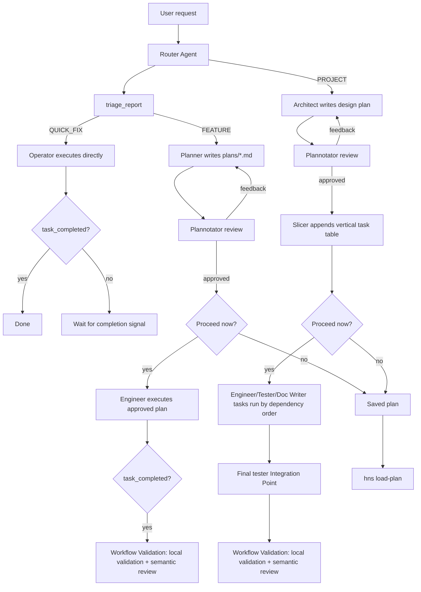

<p align="center"></p>

# Harns

**Harns** is an opinionated, plan-by-default coding harness for developers who want agents to slow down at the right
moments: classify the work, write a reviewable plan when the blast radius is real, execute through specialized roles,
and then prove the result.

It is built on top of [Pi](https://pi.dev), with a Deno CLI, an interactive TUI, a browser-based plan review loop via
[Plannotator](https://plannotator.ai), [Cymbal](https://github.com/1broseidon/cymbal) for code intelligence, and
[Mnemosyne](https://github.com/gandazgul/mnemosyne) for project/global memory.

> For full documentation, see **[docs/index.md](docs/index.md)**.

## Why Harns

Most coding harnesses optimize for getting an agent typing quickly. Harns optimizes for getting the right kind of work
done with the right amount of ceremony.

- **Triage is explicit.** Every routed request becomes `QUICK_FIX`, `FEATURE`, or `PROJECT`, with complexity and
  affected paths recorded before execution.
- **Planning is a product surface, not a prompt vibe.** Non-trivial work becomes a markdown plan in `plans/`, goes
  through Plannotator review, and can be approved, revised, saved, re-opened, or executed later.
- **Architecture and task slicing are separate jobs.** Large `PROJECT` work is designed by the Architect, then sliced
  into dependency-aware vertical tasks by the Slicer after approval.
- **Execution is role-scoped.** Operators handle small fixes, Engineers implement approved plans, Testers write or run
  test work, Doc Writers stay limited to docs, and Reviewers compare the final diff to the plan.
- **Parallel work keeps a single trail.** Project tasks can run in dependency order with bounded parallelism, while
  their final outputs are summarized back into the root session.
- **Completion has a handshake.** Execution agents are expected to call `task_completed`; for saved plan execution,
  Harns treats that as the strong signal before running validation.
- **Validation is built into plan workflows.** After completed `FEATURE` or `PROJECT` plan work, Harns runs the
  configured local validation command and then a semantic review loop against the original plan.
- **Context is durable.** Sessions live under `~/.hns/sessions/`, settings under `~/.hns/settings.json`, plans in the
  repo, and Mnemosyne keeps recallable project and global memory.

Use Harns when you want an agent workflow that leaves durable plans, review points, validation notes, and a clear record
of why each change happened. Use a lighter harness when you only want a one-shot chat wrapper around edit tools.

## High-Level Flow



## Installation

### macOS / Linux

```bash
curl -fsSL https://raw.githubusercontent.com/gandazgul/harns/main/install.sh | bash
```

The installer downloads the latest release binary for macOS or Linux, verifies checksums, and installs `hns`. By default
it installs to `~/.local/bin` and does not require root. To choose another user-writable directory, set
`HNS_INSTALL_DIR`.

### From Source

```bash
deno run -A src/cli.js help
deno task compile
./bin/hns help
```

## Runtime Requirements

End users run the standalone `hns` binary. Contributors use Deno.

Interactive agent workflows require these binaries in `PATH`:

- `mnemosyne` for project/global memory
- `cymbal` for code search, symbol lookup, impact analysis, and tracing

Harns also uses [RTK](https://github.com/rtk-ai/rtk) when `rtk` is available in `PATH`. RTK rewrites eligible
agent-initiated shell commands before execution so agents see compact command output. RTK is optional and fail-open: if
it is missing, Harns skips the rewrite hook and shows a short warning on the first few boots for each project. Manual
`!` and `!!` shell commands are never rewritten. Manage command exclusions in RTK's own configuration.

Harns stores its own data under `~/.hns/`:

- `~/.hns/sessions/` for session history
- `~/.hns/settings.json` for global settings
- `~/.hns/HARNS.md` or `~/.hns/AGENTS.md` for global Harns instructions
- `~/.hns/agents/` for home-level agent overrides
- `~/.hns/prompts/` for home-level prompt templates

By default, Harns also reads shared multi-agent instructions from `~/.agents/AGENTS.md` when no Harns-owned global
instruction file exists. Disable that shared fallback with `"enableExternalGlobalAgentsMd": false` in
`~/.hns/settings.json`.

Project-level plans and optional overrides live in the current repository:

- `plans/*.md`
- `.hns/settings.json`
- `.hns/agents/*.md`
- `.hns/prompts/*.md`

> For full documentation, see **[docs/index.md](docs/index.md)**.

## First Run

Initialize Harns in a project when you want it to build durable context:

```bash
hns init
```

The init agent explores the repository, writes `CONTEXT.md`, stores core memories, and records that init has run for
that project. You can also run `/init` inside an interactive session.

Then start a request:

```bash
hns "fix the failing parser test"
```

The default command is `router`, so this is equivalent:

```bash
hns router "fix the failing parser test"
```

Interactive sessions are optimized for one topic at a time. A new session starts with Router, but after Router hands off
to a specialist, that specialist remains active so follow-up messages keep the useful working context. Use `/new` to
start a fresh session, or `/agent router` when you want the next message in the same session to go through triage again.
Router is the default triage Agent, not a special runtime path; workflow steps are triggered by tools like
`triage_report`, `plan_written`, and `task_completed`.

## Common Commands

```bash
hns "your request"                  # route through triage
hns router "your request"           # explicit router form
hns agent                           # list available agents
hns agent engineer "implement X"    # start with Engineer instead of Router
hns plans                           # list saved plans
hns load-plan <name-or-path>        # review, execute, or continue a plan
hns init                            # bootstrap project context
hns help
hns help <command>
```

`hns help` and `hns help <command>` are generated from the command registry. Inside the TUI, `/` autocomplete is built
from the same registry plus installed prompt templates and skills.

Prompt templates from `src/prompt-templates/`, `~/.hns/prompts/`, and `.hns/prompts/` also become slash commands when
they do not collide with built-ins. Bundled skills can be invoked as `/skill:<name>`.

## Skills

Harns intentionally focuses on skill discovery and invocation rather than becoming another skill package manager. It
loads skills from these locations, in priority order:

1. Local project skills: `<repo>/.hns/skills`
2. Home skills: `~/.hns/skills`
3. Bundled skills: `src/skills`
4. External ecosystem skills: `~/.agents/skills`

Each skill lives in a directory with a `SKILL.md` file. Skills are advertised to agents by name and description, and the
full instructions are injected only when a user invokes the skill with `/skill:<name>`.

External tools can own skill installation and updates. Harns should interoperate with that ecosystem by reading
`~/.agents/skills`, making loaded skills visible, and providing clear invocation behavior.

## Plans

Plans are markdown files with YAML front matter in `plans/`. Harns records:

- classification: `QUICK_FIX`, `FEATURE`, or `PROJECT`
- complexity: `LOW`, `MEDIUM`, or `HIGH`
- summary and affected paths
- status: `draft`, `in_review`, `approved`, `ready_for_work`, `feedback`, or `completed`
- origin: `internal` or `external`

Use `hns plans` to list saved plans.

Use `hns load-plan <name-or-path>` to:

- execute an approved plan
- re-open an approved or completed plan for review
- view plan details
- continue a draft, feedback, or in-review plan
- load an external markdown plan and let Harns add front matter

`/resume` is different: it resumes a recent interactive chat session, not a plan file.

## Agents

Bundled agent definitions live in [`src/agent-definitions/`](src/agent-definitions/). They are markdown files with front
matter for name, model, description, and tools.

| Agent      | Purpose                                                             |
| ---------- | ------------------------------------------------------------------- |
| Router     | Default triage Agent that calls `triage_report`.                    |
| Operator   | Executes small `QUICK_FIX` tasks and operational work directly.     |
| Planner    | Writes reviewable plans for `FEATURE` work.                         |
| Architect  | Designs `PROJECT` plans without implementing code.                  |
| Slicer     | Converts approved project designs into vertical task tables.        |
| Engineer   | Implements approved plans or assigned project tasks.                |
| Tester     | Writes, updates, and runs tests for assigned work.                  |
| Doc Writer | Updates markdown documentation only.                                |
| Reviewer   | Compares the final diff against the original plan.                  |
| Ideator    | Researches and sharpens vague ideas before implementation planning. |

### Agent Overrides

Agent definitions are layered in this order, highest precedence first:

1. Local: `<repo>/.hns/agents`
2. Home: `~/.hns/agents`
3. Bundled: `src/agent-definitions`

Scalar front matter fields override lower layers. Prompt bodies append by default. A layer can set
`promptOverride: true` to replace lower-layer prompt content. Tool lists replace lower layers, but Harns re-adds
protected tools required for its workflow.

## Themes

Harns includes the embedded `catppuccin-mocha` theme and supports theme packages from npm, git, or local paths.

```bash
hns install npm:<package-spec>
hns install git:<url>
hns install local:<path>
hns remove <source>
```

Only JSON theme files are registered. Logic extensions, JavaScript, prompts, and skills inside packages are ignored.
Install skills with whichever external skill tooling you prefer; Harns reads compatible skills from `~/.agents/skills`
and its local/home/bundled skill directories.

Switch themes inside the TUI with `/theme`; the picker previews themes live and persists the selected theme.

See [docs/themes.md](docs/themes.md) for theme package details.

## Development

```bash
deno task cli "your request"
deno task check
deno task test
deno task ci
deno task compile
```

`deno task ci` runs check, lint, format check, and tests.

The codebase is pure JavaScript with JSDoc typing. Do not add TypeScript files or TypeScript syntax.

## Project Structure

```text
src/
  agent-definitions/   bundled agent markdown definitions
  cmd/                 command handlers and registry
  extensions/          Cymbal and Mnemosyne integrations
  prompt-templates/    bundled slash-command prompt templates
  shared/
    interactive/       TUI chat loop, slash dispatch, keybindings
    models/            model registry and validation
    session/           agent/session loading and execution
    ui/                TUI components and theme glue
    workflow/          triage dispatch, plan execution, validation
  skills/              bundled skill definitions
  tools/               Harns-specific agent tools
plans/                 persisted plans
docs/                  ADRs, PRDs, and feature docs
```

## Troubleshooting

### Mnemosyne or Cymbal Is Missing

Interactive agent workflows require both binaries in `PATH`.

- Mnemosyne: [https://github.com/gandazgul/mnemosyne#quick-start]
- Cymbal: [https://github.com/1broseidon/cymbal#install]

### Plan Review UI Does Not Open

Confirm the compiled Plannotator package can resolve:

- `@gandazgul/plannotator-pi-extension-compiled/server`
- `@gandazgul/plannotator-pi-extension-compiled/assets`

### A Saved Plan Is Not Loading

- Use `hns plans` to list plan names.
- Use `hns load-plan <name>` for a plan in `plans/`.
- Use `hns load-plan plans/<name>.md` for a direct path.
- Use `/resume` only for chat sessions.

### Agent Behavior Looks Off

- Check local overrides in `<repo>/.hns/agents/`.
- Check home overrides in `~/.hns/agents/`.
- Run `/reload` in the TUI after changing memories, settings, prompt templates, skills, models, or themes.

## Contributing

1. Create a branch.
2. Make focused changes.
3. Run `deno task ci`.
4. Open a PR with a summary, affected flow (`QUICK_FIX`, `FEATURE`, or `PROJECT`), and validation notes.

## License

Harns is source-available and free to use, but it is not open source yet.

You may install, run, inspect, and use Harns for personal, internal, or commercial work. You may also submit issues and
pull requests.

You may not distribute modified versions, publish derivative works, rebrand Harns, or offer it as a competing product or
service without prior written permission.

Harns also includes third-party dependencies, including Pi and Plannotator-related packages, which remain under their
own license terms.

See [LICENSE](LICENSE).
