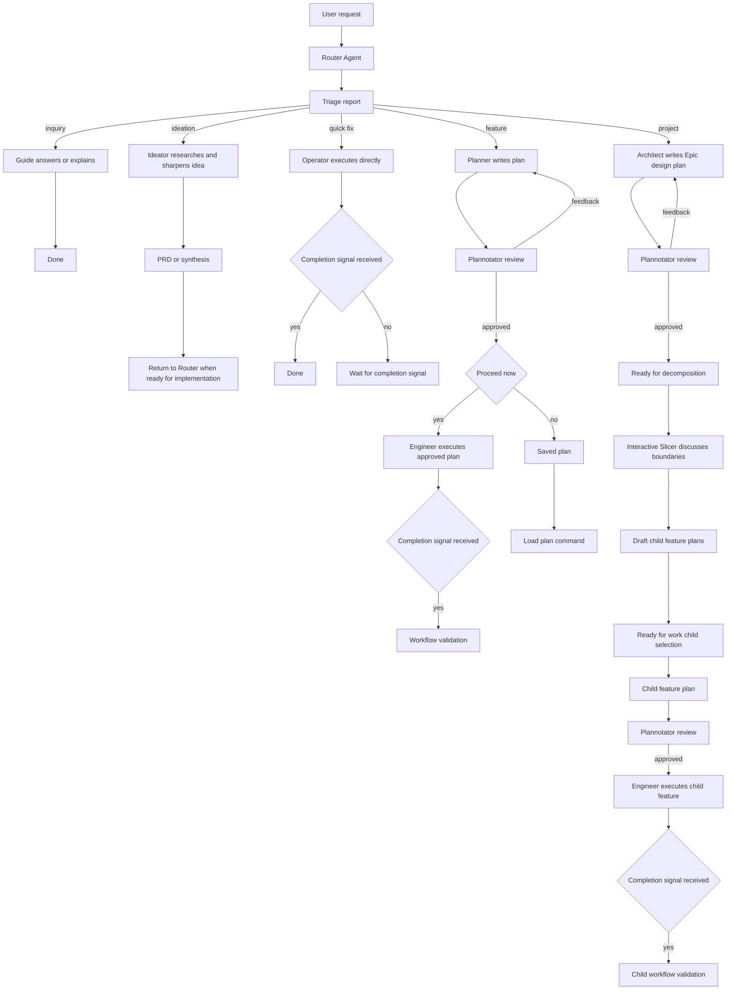

<p align="center"></p>

# RunWield

**RunWield** is an opinionated, plan-by-default coding harness for developers who want agents to slow down at the right
moments: classify the work, write a reviewable plan when the blast radius is real, execute through specialized roles,
and then prove the result.

It is built on top of [Pi](https://pi.dev), with a Deno CLI, an interactive TUI, a browser-based plan review loop via
[Plannotator](https://plannotator.ai), [Cymbal](https://github.com/1broseidon/cymbal) for code intelligence, and
[Mnemosyne](https://github.com/gandazgul/mnemosyne) for project/global memory.

> For full documentation, see **[docs/index.md](docs/index.md)**.

## Why RunWield

Most coding harnesses optimize for getting an agent typing quickly. RunWield optimizes for getting the right kind of
work done with the right amount of ceremony.

- **Triage is explicit.** Every routed request gets a routing intent: `INQUIRY`, `IDEATION`, `QUICK_FIX`, `FEATURE`, or
  `PROJECT`. Implementation work records complexity and affected paths before execution.
- **Planning is a product surface, not a prompt vibe.** Non-trivial work becomes a markdown plan in `plans/`, goes
  through Plannotator review, and can be approved, revised, saved, re-opened, or executed later.
- **Architecture and decomposition are separate jobs.** Large `PROJECT` work is designed by the Architect as an Epic,
  then decomposed into independently executable child `FEATURE` plans by the Slicer after approval.
- **Execution is role-scoped.** Operators handle small fixes, Engineers implement approved plans, Testers write or run
  test work, documentation is handled through the `documentation` skill, and Reviewers compare the final diff to the
  plan.
- **Epic work keeps a clear trail.** PROJECT Epics stay as containers, while child FEATURE plans carry their own review,
  execution, validation, and merge history.
- **Completion has a handshake.** Execution agents are expected to call `task_completed`; for saved plan execution,
  RunWield treats that as the strong signal before running validation.
- **Validation is built into plan workflows.** After completed executable plan work, RunWield runs the configured local
  validation command and then a semantic review loop against the original plan. PROJECT Epics validate through their
  child FEATURE plans.
- **Context is durable.** Sessions live under `~/.wld/sessions/`, settings under `~/.wld/settings.json`, plans in the
  repo, and [Mnemosyne](https://github.com/gandazgul/mnemosyne) keeps recallable project and global memory.

Use RunWield when you want an agent workflow that leaves durable plans, review points, validation notes, and a clear
record of why each change happened. Use a lighter harness when you only want a one-shot chat wrapper around edit tools.

## High-Level Flow



## Installation

### macOS / Linux

```bash
curl -fsSL https://raw.githubusercontent.com/gandazgul/runwield/main/install.sh | bash
```

The installer downloads the latest release binary for macOS or Linux, verifies checksums, and installs `wld`. By default
it installs to `~/.local/bin` and does not require root. To choose another user-writable directory, set
`WLD_INSTALL_DIR`.

### From Source

```bash
deno run -A src/cli.js help
deno task compile
./bin/wld help
```

## Runtime Requirements

End users run the standalone `wld` binary. Contributors use Deno.

Interactive agent workflows require these binaries in `PATH`:

- [`mnemosyne`](https://github.com/gandazgul/mnemosyne) for project/global memory
- [`cymbal`](https://github.com/1broseidon/cymbal) for code search, symbol lookup, impact analysis, and tracing

RunWield also uses [`snip`](https://github.com/edouard-claude/snip) when `snip` is available in `PATH`. Snip proxies
eligible agent-initiated shell commands so agents see compact command output. Snip is optional and fail-open: if it is
missing, RunWield skips the prefix hook and shows a short warning on the first few boots for each project. Manual `!`
and `!!` shell commands are never rewritten. RunWield ships Snip filters for `deno check`, `deno fmt`, `deno lint`, and
`deno test`. The installer can opt-in install those filters into Snip's default user filter directory so plain
`snip run -- deno ...` commands can use them; remove those user-level copies with `wld snip-filters cleanup`.

RunWield stores its own data under `~/.wld/`:

- `~/.wld/sessions/` for session history
- `~/.wld/settings.json` for global settings
- `~/.wld/RUNWEILD.md` or `~/.wld/AGENTS.md` for global RunWield instructions
- `~/.wld/agents/` for home-level agent overrides
- `~/.wld/prompts/` for home-level prompt templates

By default, RunWield also reads shared multi-agent instructions from `~/.agents/AGENTS.md` when no RunWield-owned global
instruction file exists. Disable that shared fallback with `"enableExternalGlobalAgentsMd": false` in
`~/.wld/settings.json`.

For editor autocomplete and validation, `~/.wld/settings.json` and `.wld/settings.json` can include
`"$schema": "https://github.com/gandazgul/runwield/releases/latest/download/config.schema.json"`. See
[docs/settings.md](docs/settings.md) for the complete settings reference.

Project-level plans and optional overrides live in the current repository:

- `plans/*.md`
- `.wld/settings.json`
- `.wld/agents/*.md`
- `.wld/prompts/*.md`

> For full documentation, see **[docs/index.md](docs/index.md)**.

## First Run

Initialize RunWield in a project when you want it to build durable context:

```bash
wld init
```

The init agent explores the repository, writes `CONTEXT.md`, stores core memories, and records that init has run for
that project. You can also run `/init` inside an interactive session.

Then start a request:

```bash
wld "fix the failing parser test"
```

The default command is `router`, so this is equivalent:

```bash
wld router "fix the failing parser test"
```

Interactive sessions are optimized for one topic at a time. A new session starts with Router, but after Router hands off
to Guide, Ideator, Operator, Planner, Architect, or another specialist, that specialist remains active so follow-up
messages keep the useful working context. Use `/new` to start a fresh session, or `/agent router` when you want the next
message in the same session to go through triage again. Router is the default triage Agent, not a special runtime path;
workflow steps are triggered by tools like `triage_report`, `plan_written`, and `task_completed`.

## Common Commands

```bash
wld "your request"                  # route through triage
wld router "your request"           # explicit router form
wld agent                           # list available agents
wld agent engineer "implement X"    # start with Engineer instead of Router
wld plans                           # list saved plans
wld plans ui --no-open              # start the local read-only Plans Workspace
wld load-plan <name-or-path>        # review, execute, or continue a plan
wld init                            # bootstrap project context
wld snip-filters install            # optional: install Deno filters for plain snip commands
wld snip-filters cleanup            # remove RunWield-managed user Snip filters
wld help
wld help <command>
```

`wld help` and `wld help <command>` are generated from the command registry. Inside the TUI, `/` autocomplete is built
from the same registry plus installed prompt templates and skills.

Prompt templates from `src/prompt-templates/`, `~/.wld/prompts/`, and `.wld/prompts/` also become slash commands when
they do not collide with built-ins. Bundled skills can be invoked as `/skill:<name>`.

## Skills

RunWield intentionally focuses on skill discovery and invocation rather than becoming another skill package manager. It
loads skills from these locations, in priority order:

1. Local project skills: `<repo>/.wld/skills`
2. Home skills: `~/.wld/skills`
3. Bundled skills: `src/skills`
4. External ecosystem skills: `~/.agents/skills`

Each skill lives in a directory with a `SKILL.md` file. Skills are advertised to agents by name and description, and the
full instructions are injected only when a user invokes the skill with `/skill:<name>` or an agent loads a matching
skill. The bundled `documentation` skill guides Markdown docs work that used to require a dedicated docs role.

External tools can own skill installation and updates. RunWield should interoperate with that ecosystem by reading
`~/.agents/skills`, making loaded skills visible, and providing clear invocation behavior.

## Plans

Plans are markdown files with YAML front matter in `plans/`. RunWield records:

- routing intent: `INQUIRY`, `IDEATION`, `QUICK_FIX`, `FEATURE`, or `PROJECT` for routed requests
- plan classification: `FEATURE` or `PROJECT` for saved implementation plans
- complexity: `LOW`, `MEDIUM`, or `HIGH`
- summary and affected paths
- status: `draft`, `feedback`, `approved`, `ready_for_decomposition`, `ready_for_work`, `in_progress`, `failed`,
  `implemented`, `verified`, `closed_without_verification`, or `on_hold`
- origin: `internal` or `external`
- Epic metadata: `type: epic` on PROJECT Epic containers, plus `parentPlan` and optional `dependencies` on child FEATURE
  plans

PROJECT plans are Epics by default: the parent PROJECT plan is a container for design and decomposition state, not an
implementation unit. The interactive Slicer helps choose vertical child FEATURE boundaries, writes draft children under
`plans/<epic-name>/`, and finalizes the Epic only after explicit confirmation. Each child FEATURE then follows the
normal FEATURE lifecycle with its own review, execution, validation, and merge history.

Use `wld plans` to list saved plans. Epic children are grouped under their parent, and orphaned child plans are shown
separately.

Use `wld plans ui` to launch the local browser Workspace for the current checkout:

```bash
wld plans ui --no-open
```

The Workspace is a read-only milestone: it shows Board, Closed, On Hold, and Plan detail views, but does not provide
edit, drag/drop, or lifecycle mutation controls. It serves non-archived Plans from the checkout where the command was
started and uses stable `planId` detail URLs. Plans missing `planId` may be backfilled by the existing Plan resource
loader; Plan bodies and lifecycle fields are not changed by the UI.

Security defaults are intentionally local-first. The server binds to `127.0.0.1` and a random available port by default,
prints a tokenized URL, and requires that per-server token for Workspace HTML and API access. Plan markdown is local
plaintext and may contain sensitive context. If you explicitly expose the server with `--bind`/`--host` (for example
`wld plans ui --bind 0.0.0.0 --no-open`), RunWield prints a warning before serving. No permissive CORS is enabled.

Use `wld load-plan <name-or-path>` to:

- execute a ready standalone FEATURE or child FEATURE plan
- open or resume Slicer decomposition for a PROJECT Epic
- pick a child FEATURE plan from a decomposed Epic
- mark a decomposed Epic done enough for now when appropriate
- re-open an approved, implemented, or verified plan for review
- view plan or Epic details
- continue a draft or feedback plan
- load an external markdown plan and let RunWield add front matter

`/resume` is different: it resumes a recent interactive chat session, not a plan file.

## Agents

Bundled agent definitions live in [`src/agent-definitions/`](src/agent-definitions/). They are markdown files with front
matter for name, model, description, and tools.

| Agent     | Purpose                                                                    |
| --------- | -------------------------------------------------------------------------- |
| Router    | Default triage Agent that calls `triage_report`.                           |
| Guide     | Answers `INQUIRY` requests and provides direct help or explanation.        |
| Ideator   | Researches and sharpens `IDEATION` requests before planning.               |
| Operator  | Executes small `QUICK_FIX` tasks and operational work directly.            |
| Planner   | Writes reviewable plans for `FEATURE` work.                                |
| Architect | Designs `PROJECT` plans without implementing code.                         |
| Slicer    | Decomposes approved PROJECT Epics into child FEATURE plans.                |
| Engineer  | Implements approved executable plans and uses skills for specialized work. |
| Tester    | Writes, updates, and runs tests for assigned work.                         |
| Reviewer  | Compares the final diff against the original plan.                         |

### Agent Overrides

Agent definitions are layered in this order, highest precedence first:

1. Local: `<repo>/.wld/agents`
2. Home: `~/.wld/agents`
3. Bundled: `src/agent-definitions`

Scalar front matter fields override lower layers. Prompt bodies append by default. A layer can set
`promptOverride: true` to replace lower-layer prompt content. Tool lists replace lower layers, but RunWield re-adds
protected tools required for its workflow.

## Themes

RunWield includes the embedded `catppuccin-mocha` theme and supports theme packages from npm, git, or local paths.

```bash
wld install npm:<package-spec>
wld install git:<url>
wld install local:<path>
wld remove <source>
```

Only JSON theme files are registered. Logic extensions, JavaScript, prompts, and skills inside packages are ignored.
Install skills with whichever external skill tooling you prefer; RunWield reads compatible skills from
`~/.agents/skills` and its local/home/bundled skill directories.

Switch themes inside the TUI with `/theme`; the picker previews themes live and persists the selected theme.

See [docs/themes.md](docs/themes.md) for theme package details.

## Development

```bash
deno task cli "your request"
deno task check
deno task test
deno task ci
deno task compile
```

`deno task ci` runs check, lint, format check, and tests.

The codebase is pure JavaScript with JSDoc typing. Do not add TypeScript files or TypeScript syntax.

## Project Structure

```text
src/
  agent-definitions/   bundled agent markdown definitions
  cmd/                 command handlers and registry
  extensions/          external tool integrations
  prompt-templates/    bundled slash-command prompt templates
  shared/
    interactive/       TUI chat loop, slash dispatch, keybindings
    models/            model registry and validation
    session/           agent/session loading and execution
    ui/                TUI components and theme glue
    workflow/          triage dispatch, plan execution, validation
  skills/              bundled skill definitions
  tools/               RunWield-specific agent tools
plans/                 persisted plans
docs/                  ADRs, PRDs, and feature docs
```

## Troubleshooting

### [Mnemosyne](https://github.com/gandazgul/mnemosyne) or [Cymbal](https://github.com/1broseidon/cymbal) Is Missing

Interactive agent workflows require both binaries in `PATH`.

- [Mnemosyne](https://github.com/gandazgul/mnemosyne): [quick start](https://github.com/gandazgul/mnemosyne#quick-start)
- [Cymbal](https://github.com/1broseidon/cymbal): [install](https://github.com/1broseidon/cymbal#install)

### Plan Review UI Does Not Open

Confirm the compiled Plannotator package can resolve:

- `@gandazgul/plannotator-pi-extension-compiled/server`
- `@gandazgul/plannotator-pi-extension-compiled/assets`

### A Saved Plan Is Not Loading

- Use `wld plans` to list plan names.
- Use `wld load-plan <name>` for a plan in `plans/`.
- Use `wld load-plan plans/<name>.md` for a direct path.
- Use `/resume` only for chat sessions.

### Agent Behavior Looks Off

- Check local overrides in `<repo>/.wld/agents/`.
- Check home overrides in `~/.wld/agents/`.
- Run `/reload` in the TUI after changing memories, settings, prompt templates, skills, models, or themes.

## Contributing

1. Create a branch.
2. Make focused changes.
3. Run `deno task ci`.
4. Open a PR with a summary, affected routing intent or flow (`INQUIRY`, `IDEATION`, `QUICK_FIX`, `FEATURE`, or
   `PROJECT`), and validation notes.

## License

RunWield is source-available and free to use, but it is not open source yet.

You may install, run, inspect, and use RunWield for personal, internal, or commercial work. You may also submit issues
and pull requests.

You may not distribute modified versions, publish derivative works, rebrand RunWield, or offer it as a competing product
or service without prior written permission.

RunWield also includes third-party dependencies, including Pi and Plannotator-related packages, which remain under their
own license terms.

See [LICENSE](LICENSE).
