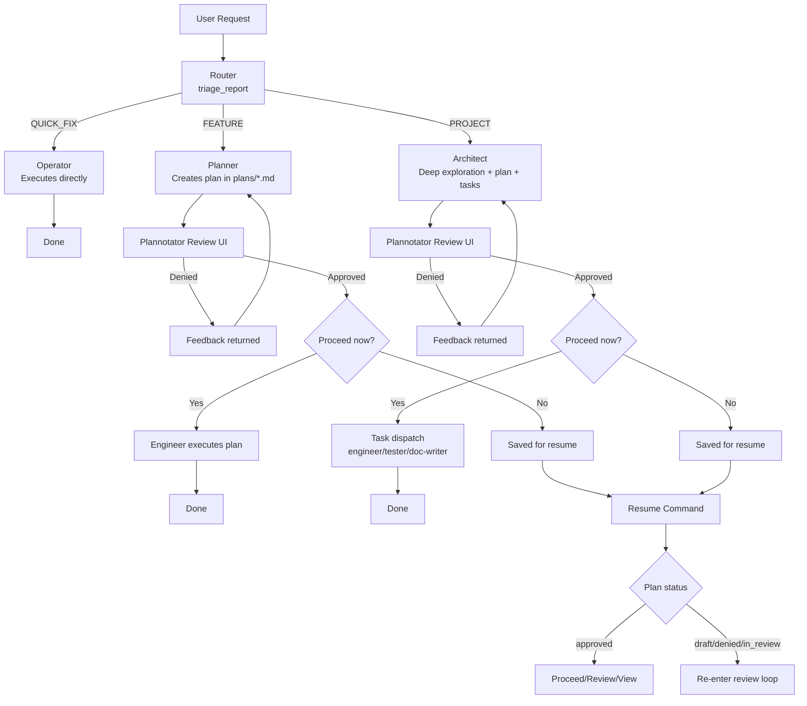

<p align="center"></p>

**Harns** is an opinionated, **plan-by-default coding hnsness** built on top of [Pi](https://pi.dev).

It routes incoming requests through triage, creates reviewable plans for non-trivial work, runs an interactive
[Plannotator](https://plannotator.ai) approval loop, and then executes approved work with specialized agents.

## Why Harns

- **Plan-first by default** for medium/large requests
- **Explicit triage** (`QUICK_FIX`, `FEATURE`, `PROJECT`)
- **Human-in-the-loop review** before execution
- **Multi-agent execution** for project-scale plans
- **Resume support** for saved/paused plans

---

## High-Level Flow



---

## Agent Catalog

Bundled agent definitions live in [`src/agent-definitions/`](src/agent-definitions/).

| Agent      | Purpose                                                                       | Prompt                                               |
| ---------- | ----------------------------------------------------------------------------- | ---------------------------------------------------- |
| Router     | Classifies incoming requests and emits structured triage data.                | [router.md](src/agent-definitions/router.md)         |
| Operator   | Executes small, low-risk `QUICK_FIX` tasks directly.                          | [operator.md](src/agent-definitions/operator.md)     |
| Planner    | Produces iterative, execution-ready plans for `FEATURE` requests.             | [planner.md](src/agent-definitions/planner.md)       |
| Architect  | Produces deeper, project-scale plans (including task decomposition) and ADRs. | [architect.md](src/agent-definitions/architect.md)   |
| Engineer   | Implements approved plans or assigned tasks in code.                          | [engineer.md](src/agent-definitions/engineer.md)     |
| Tester     | Writes/updates tests for approved changes.                                    | [tester.md](src/agent-definitions/tester.md)         |
| Doc Writer | Creates or updates technical documentation artifacts.                         | [doc-writer.md](src/agent-definitions/doc-writer.md) |

### Agent Overrides (`.hns/agents`)

You can override bundled agent definitions with markdown files in these locations, with Precedence (highest to lowest):

1. Local (`<repo>/.hns/agents`)
2. Home (`~/.hns/agents`)
3. Bundled (`src/agent-definitions`)

Merge behavior:

- Frontmatter scalar fields (`name`, `model`, `description`, etc.) override by precedence.
- `tools` arrays are merged (union + dedupe), so higher layers can add tools without removing defaults.
- Prompt body appends by default across layers.
- If a layer sets `promptOverride: true`, lower-layer prompt content is discarded and replaced from that layer onward.

---

## Runtime & Dependencies

- End-user runtime: **Standalone `hns` binary** (no Deno required)
- Contributor/dev runtime: **Deno**
- Core libraries:
  - `@mariozechner/pi-coding-agent`
  - `@mariozechner/pi-ai`
  - `@mariozechner/pi-agent-core`
  - `@plannotator/pi-extension`
  - `@gandazgul/plannotator-pi-extension-compiled` (compiled Plannotator UI assets for in-process review)
- Memory layer:
  - **[Mnemosyne](https://github.com/gandazgul/mnemosyne)** (integrated persistent memory)

---

## Installation

### macOS / Linux (recommended)

```bash
curl -fsSL https://raw.githubusercontent.com/gandazgul/harns/main/install.sh | bash
```

Then verify:

```bash
hns --help
```

### Source-run (contributors)

1. Install Deno: https://docs.deno.com/runtime/getting_started/installation/

2. Run from source:

```bash
deno run -A src/cli.js --help
```

3. Or compile

```bash
deno run compile
./bin/hns --help
```

---

## Usage

### Run a new request (default router command)

```bash
hns "your request here"
```

Equivalent explicit form (router is the default command):

```bash
hns router "your request here"
```

Examples:

```bash
hns "fix typo in README"
hns router "add JWT auth to API"
hns "refactor data layer and add migration plan"
```

### Show help

```bash
hns --help # or hns help
hns help <command>
hns <command> --help
```

### Resume a saved plan

By plan name:

```bash
hns resume integrate-mnemosyne
```

By path:

```bash
hns resume plans/integrate-mnemosyne.md
```

### List saved plans

```bash
hns plans
```

### Optimize memory

```bash
hns sleep
```

---

## Deno Tasks

Defined in [`deno.json`](deno.json):

```bash
deno task cli "your request"
deno task ci # runs lint, typecheck, format checks and tests
deno task compile
```

---

## Plan Files & Status

Plans are stored in [`plans/`](plans/) as markdown files with YAML front matter.

Common statuses:

- `draft`
- `in_review`
- `approved`
- `done`

Harns updates these statuses during the review loop and resume flow.

---

## Project Structure

```text
├── docs/                    # Documentation (ADR, skills spec, etc.)
│   └── adr/                 # Architecture Decision Records
├── plans/                   # Generated/saved plan files
└── src/
    ├── agent-definitions/   # Bundled default agent markdown definitions
    ├── cli.js               # CLI entrypoint + command dispatch
    ├── cmd/                 # Command handlers (one subdirectory per command)
    │   ├── agents/          # agents command (list/view agents)
    │   ├── export/          # export command
    │   ├── help/            # Global/per-command help command
    │   ├── models/          # models command
    │   ├── new/             # new command
    │   ├── plans/           # plans command (list saved plans)
    │   ├── quit/            # quit command
    │   ├── registry.js      # Command registry
    │   ├── resume/          # resume command
    │   ├── resume-plan/     # resume-plan command
    │   ├── router/          # Default request routing command
    │   ├── session/         # session command
    │   └── sleep/           # sleep command (memory optimization)
    ├── constants.js         # CLI/runtime constants
    ├── extensions/          # Extension integrations
    │   ├── cymbal/          # Cymbal code search extension
    │   └── mnemosyne/       # Mnemosyne memory layer extension
    ├── plan-store.js        # Plan persistence/front matter utilities
    ├── prompt-templates/    # Reusable prompt template files
    ├── shared/              # Shared core modules
    │   ├── chat-session.js  # Interactive TUI session
    │   ├── clipboard.js     # Clipboard utilities
    │   ├── models/          # Model registry & validation
    │   ├── runtime-preflight.js
    │   ├── session/         # Session state, agent discovery, direct-agent handler
    │   ├── settings.js      # Settings manager singleton
    │   ├── ui/              # UI components, theme, TUI singleton, prompt overlays
    │   └── workflow/        # Plan workflow & Plannotator review
    └── tools/               # Agent-accessible tool implementations
        ├── plan-written.js
        ├── switch-agent.js
        ├── triage-report.js
        └── user-interview.js
```

---

## Troubleshooting

### Plan review UI does not open

- Confirm `src/tools/submit-plan.js` can resolve:
  - `@gandazgul/plannotator-pi-extension-compiled/server`
  - `@gandazgul/plannotator-pi-extension-compiled/assets`
- Verify you are on a version where the package exports `plannotatorHtml`.

### Resume can’t find your plan

- Use `hns plans` to list available plan names.
- Use `plans/<name>.md` path form if needed.
- Don’t prefix with `@plans/...`; use `plans/...`.

### Agent behavior looks off

- Installed binaries use bundled defaults from `src/agent-definitions/`.
- Check for overrides in `~/.hns/agents/` and `<repo>/.hns/agents/`.
- For source runs, inspect/edit the relevant bundled prompt in `src/agent-definitions/` (or provide an override) and
  re-run.

---

## Contributing

1. Create a branch
2. Make focused changes
3. Run:

```bash
deno task ci
```

4. Open a PR with:
   - summary
   - affected flow (`QUICK_FIX`/`FEATURE`/`PROJECT`)
   - test/verification notes

---

## License

Unlicensed for now. I retain full copyright and all rights reserved, but you can view the code and open issues. If you
want to contribute or use parts of the code, please reach out.
