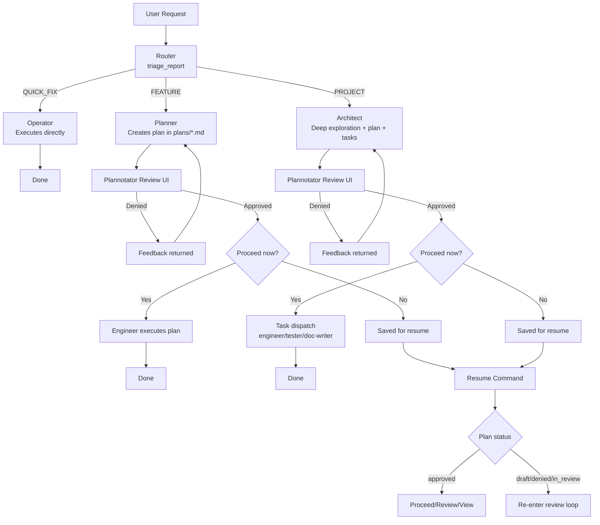

# Harness

Harness is an opinionated, **plan-by-default coding harness** built on top of Pi agents.

It routes incoming requests through triage, creates reviewable plans for non-trivial work, runs an interactive 
Plannotator approval loop, and then executes approved work with specialized agents.

## Why Harness

- **Plan-first by default** for medium/large requests
- **Explicit triage** (`QUICK_FIX`, `FEATURE`, `PROJECT`)
- **Human-in-the-loop review** before execution
- **Multi-agent execution** for project-scale plans
- **Resume support** for saved/paused plans

---

## High-Level Flow



---

## Agent Catalog

All agent prompts live in [`.pi/agents/`](.pi/agents/).

| Agent | Purpose | Prompt |
|---|---|---|
| Router | Classifies incoming requests and emits structured triage data. | [router.md](.pi/agents/router.md) |
| Operator | Executes small, low-risk `QUICK_FIX` tasks directly. | [operator.md](.pi/agents/operator.md) |
| Planner | Produces iterative, execution-ready plans for `FEATURE` requests. | [planner.md](.pi/agents/planner.md) |
| Architect | Produces deeper, project-scale plans (including task decomposition). | [architect.md](.pi/agents/architect.md) |
| Engineer | Implements approved plans or assigned tasks in code. | [engineer.md](.pi/agents/engineer.md) |
| Tester | Writes/updates tests for approved changes. | [tester.md](.pi/agents/tester.md) |
| Doc Writer | Creates or updates technical documentation artifacts. | [doc-writer.md](.pi/agents/doc-writer.md) |
| Explorer | Performs focused vertical-slice investigation when used. | [explorer.md](.pi/agents/explorer.md) |

---

## Runtime & Dependencies

- Runtime: **Deno**
- Core libraries:
  - `@mariozechner/pi-coding-agent`
  - `@mariozechner/pi-ai`
  - `@mariozechner/pi-agent-core`
- Plan review integration:
  - `@gandazgul/plannotator-pi-extension-compiled`

> Current repo maps the compiled Plannotator package locally in `deno.json`:
>
> `"@gandazgul/plannotator-pi-extension-compiled": "npm:./plannotator-pi-extension-compiled"`

---

## Setup

### 1) Install Deno

Follow: https://docs.deno.com/runtime/getting_started/installation/

### 2) Install dependencies

From project root:

```bash
deno cache src/cli.js
```

(Or run any task below; Deno will fetch on demand.)

### 3) Ensure agent prompts exist

Harness expects `.pi/agents/*.md` files (already present in this repo).

---

## Usage

### Run a new request

```bash
deno run -A src/cli.js "your request here"
```

Examples:

```bash
deno run -A src/cli.js "fix typo in README"
deno run -A src/cli.js "add JWT auth to API"
deno run -A src/cli.js "refactor data layer and add migration plan"
```

### Resume a saved plan

By plan name:

```bash
deno run -A src/cli.js resume integrate-mnemosyne
```

By path:

```bash
deno run -A src/cli.js resume plans/integrate-mnemosyne.md
```

### List saved plans

```bash
deno run -A src/cli.js plans
```

---

## Deno Tasks

Defined in [`deno.json`](deno.json):

```bash
deno task cli "your request"
deno task resume <plan-name>
deno task check
```

---

## Plan Files & Status

Plans are stored in [`plans/`](plans/) as markdown files with YAML front matter.

Common statuses:

- `draft`
- `in_review`
- `approved`
- `denied`

Harness updates these statuses during the review loop and resume flow.

---

## Project Structure

```text
.
├── .pi/agents/              # Agent prompt definitions
├── plans/                   # Generated/saved plan files
├── src/
│   ├── cli.js               # Main orchestration entrypoint
│   ├── plan-store.js        # Plan persistence/front matter utilities
│   └── tools/
│       ├── triage-report.js # Router structured triage tool
│       └── submit-plan.js   # In-process Plannotator review integration
├── deno.json
└── README.md
```

---

## Troubleshooting

### Plan review UI does not open

- Confirm `src/tools/submit-plan.js` can resolve
  `@gandazgul/plannotator-pi-extension-compiled/server`.
- If using local mapping, ensure `plannotator-pi-extension-compiled/` exists and is built.
- Verify the package contains `plannotator.html` and `review-editor.html`.

### Resume can’t find your plan

- Use `deno run -A src/cli.js plans` to list available plan names.
- Use `plans/<name>.md` path form if needed.
- Don’t prefix with `@plans/...`; use `plans/...`.

### Agent behavior looks off

- Inspect/edit the relevant agent prompt in `.pi/agents/`.
- Re-run the request; prompts are loaded from disk each run.

---

## Contributing

1. Create a branch
2. Make focused changes
3. Run:

```bash
deno task check
```

4. Open a PR with:
   - summary
   - affected flow (`QUICK_FIX`/`FEATURE`/`PROJECT`)
   - test/verification notes

---

## License

Add your license here (e.g. MIT) if/when this repository is public.
