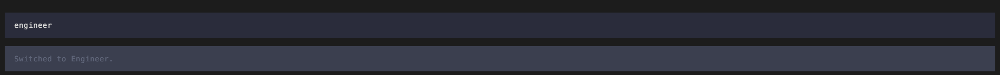
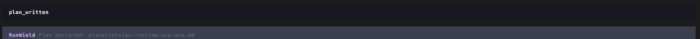
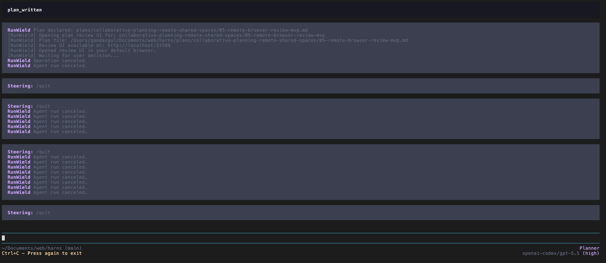

# TODO

## Bugs

P1 critical bug

- [x] Cancelling a repair request after a worktree merge conflict destroys the worktree and all the work is gone. 1st
      the orchestrator needs to listen for a task_completed signal not just LLM stop, this should eb a golden rule since
      we have this tool. 2nd the orchestrator needs to ensure the changes are ACTUALLY merged in before deleting the
      worktree, if unsure then stop and tell the user.

- [x] hittin up arrow when there's a scheduled steering message, fills the input but, doesnt remove the scheduled
      message.
- [ ] when queing up a steering message with an image the fact that the image is attached is not shown in the steering:
      block
- [ ] when I use /agent the name of the agent is shown then the system message switched to agent, hide the agent name
      that replaces the multiselect. 
- [ ] fold the runwield system message plan declared into the tool call block so it doesnt look visually broken
      
- [ ] The commit message for worktrees is cutting the name of the plans it shouldn't e.g.
      `* Complete session-host-multi-session-refactor/05-wo`
- [ ] cancelling with esc while waiting on plannotator doesnt allow slash commands to work correctly and hitting esc
      again outputs the message but doesnt actually restore the TUI. 

## Backlog

### P1 - Core Workflow UX

- Workspace recovery UX for in_progress / failed / implemented is not really there. Workspace has lifecycle mutations,
  but not the richer recovery menu/actions from CLI.
- Validation reports appear not to be first-class persisted/displayed reports. Current UI mostly exposes failureReason,
  worktreeStatus, timestamps, and metadata.
- “What changed since approval?” summaries are not implemented as stated. There is:
  - affected-path commit warning before execution using updatedAt/createdAt
  - recovery diff since executionBaselineTree
  - but not a dedicated “since approval” summary.
- Re-review flows in Workspace are limited; CLI has the meaningful flow.
  [docs/plan-lifecycle.md](docs/plan-lifecycle.md).
- [x] Expose compaction settings and make the current compaction behavior easier to inspect:
      [docs/prd/compaction-PRD.md](docs/prd/compaction-PRD.md).
- [x] Add `/reload` to refresh dynamic system-prompt content on the live root `AgentSession` after memory, skill, or
      `RUNWEILD.md` changes.
- [ ] Refactor before broad test expansion: `src/shared/interactive/chat-session.js` and
      `src/shared/session/root-session.js` are the main candidates.
- [ ] Add more focused tests after the refactor boundaries are clearer.

- [ ] Implement Guided Reviews using plnnotator

```markdown
Large changesets are hard to review top-to-bottom in file order. A Guided Review has an agent organize the current
changeset — any PR or local diff — into importance-ordered chapters: the heart of the change first, its consequences
next, glue last. Each section pairs a prose overview and per-file summaries with the live diffs it covers, and those
diffs are the real diff viewer — annotations made inside a guide land in the same review state and export in the same
feedback as everywhere else.

Open it with the Guide button in the review header or Mod+Shift+G, pick an engine and model, and generate. Sections
track their own reviewed state so you can work through a big change across sittings. Guides run on Claude or Codex
natively, and on Cursor, OpenCode, Pi, or GitHub Copilot CLI when installed. Every changed file is validated against the
real diff server-side, so a guide can never invent files or drop them silently.

A one-time intro dialog announces the feature on first open, and the Guide button carries a subtle hint until the first
time you use it.
```

### P2 - Extension and Package Ecosystem

- [ ] Build the optional Colgrep semantic search extension:
      [plans/colgrep-semantic-search-extension.md](plans/colgrep-semantic-search-extension.md).

### P3 - Search, Memory, and Metrics

- [ ] Record local-only workflow metrics for routing, planning, execution, validation, recovery, and model-selection
      decisions.
- [ ] Use those metrics to evaluate Router accuracy, plan stall points, Slicer outcomes, auto-sleep triggers, worktree
      recovery rates, and model behavior.
- [ ] Define auto-sleep trigger policy around session end, memory churn, session age, context size, and plan completion.
- [ ] Add a refresh path for core project memories beyond `/sleep`, while keeping Mnemosyne core memories as the source
      of the compressed project brief.

### P4 - Model Reliability and Capability Transparency

- [x] Add a clear model fallback policy for unavailable configured models/auth.
- [x] Build Router classification fixtures to evaluate routing quality across models.
- [ ] Define Planner/Architect plan-quality evaluation rubrics.
- [ ] Explore repo-local execution harnesses for Engineer/Operator model evaluation.
- [ ] Add a resolved capability viewer showing each agent's effective tools, prompt source layers, runtime narrowing,
      protected-tool reinjection, and custom-tool additions.

### P5 - Collaboration

- [ ] Revisit collaborative planning when local lifecycle/plan hygiene is stable:
      [docs/prd/collaborative-planning-PRD.md](docs/prd/collaborative-planning-PRD.md).

### P6 - Security and Hardening

- [ ] Add Security Reviewer as an optional planning/review gate for production-oriented FEATURE and PROJECT workflows.
- [ ] Make security review mode-aware so prototypes and one-off builds can bypass it.
- [ ] Investigate running restricted agents' bash commands under a read-only OS user for stronger write barriers.

### Lower Priority / Someday

- [ ] Consider making this theme the default:
      <https://github.com/ifiokjr/oh-pi/blob/main/packages/themes/themes/oh-p-dark.json>.
