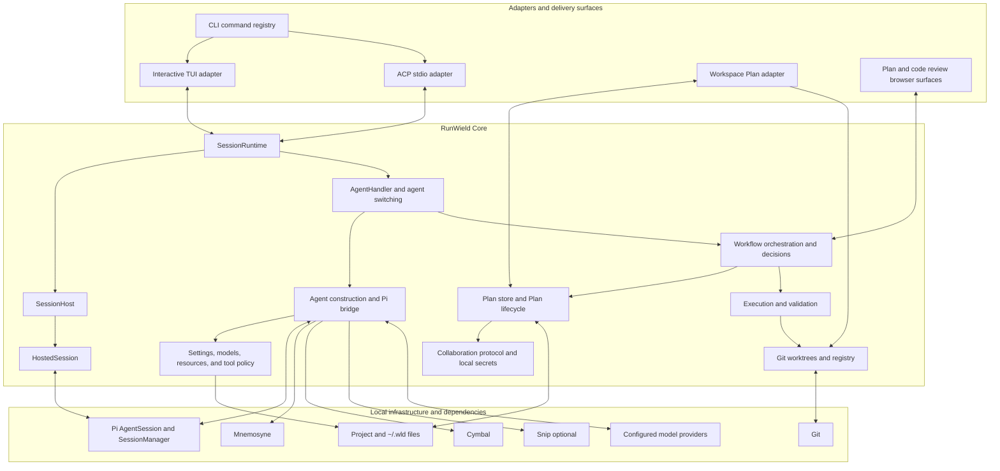
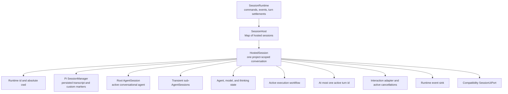
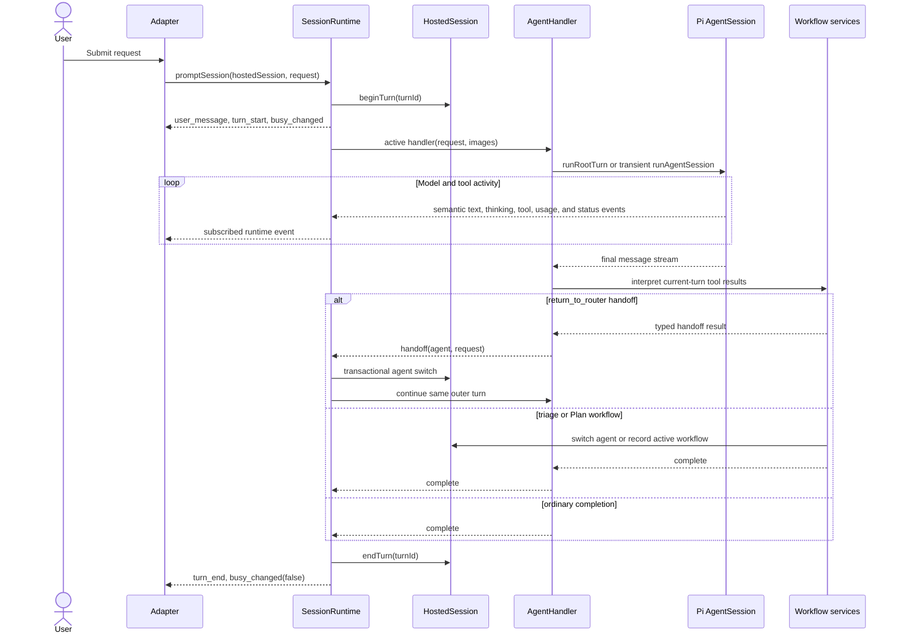
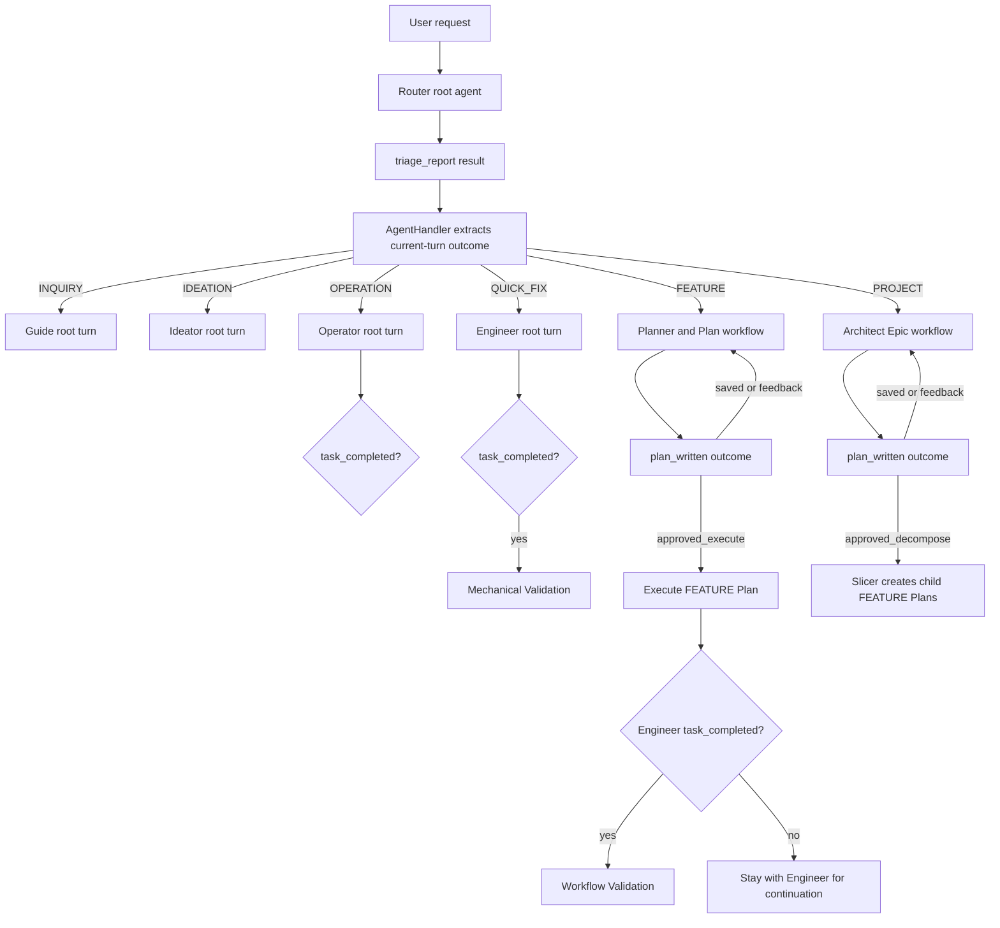
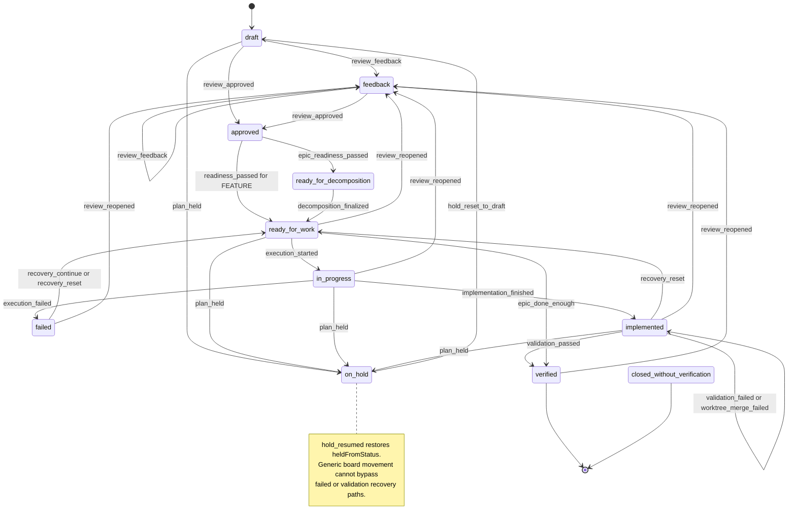
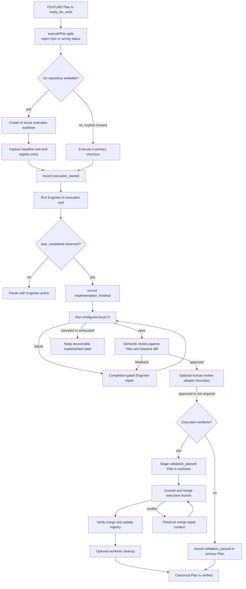
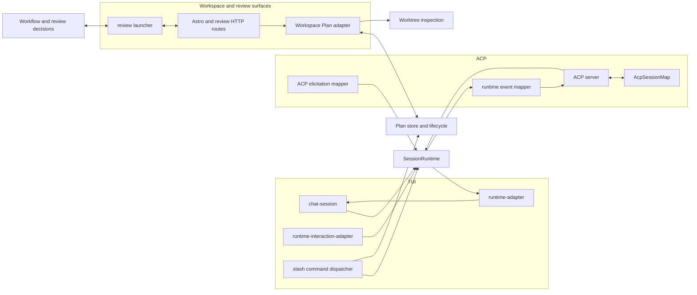

# RunWield Core Architecture

This document describes the current architecture of RunWield Core, with emphasis on the UI-independent session runtime,
agent construction, workflow orchestration, Plan lifecycle, execution, validation, and persistence systems. The TUI, ACP
server, Workspace, and browser review surfaces are described only as adapters over those systems.

The document is implementation-facing. It describes the source as it exists, including transitional seams that are
important when evaluating stability and test coverage. It is not a statement that every current boundary is already the
desired final boundary.

## Architectural intent

RunWield Core is a local-first engine that turns a user request into a persistent, policy-constrained agent session and,
when appropriate, a durable Plan workflow. The central design goals are:

- keep conversation and execution state scoped to an explicit project root;
- make the session runtime independent of any one presentation protocol;
- use agent tool results as structured workflow signals;
- keep Plan state in versionable Markdown rather than an opaque database;
- isolate implementation work in Git worktrees when Git is available;
- require explicit completion and validation signals before advancing durable state;
- allow UIs and external protocols to translate core events and interactions without owning core state.

## System at a glance

The session runtime is the application boundary for interactive conversations. Plan persistence and lifecycle form a
second core boundary used both by session workflows and by the Workspace. The workflow layer joins the two: it consumes
structured agent outcomes, calls Plan and execution services, and decides which agent owns the next step.

## Core boundary

| Area                        | Responsibilities                                                                                                     | Primary implementation                                                                                                                                   |
| --------------------------- | -------------------------------------------------------------------------------------------------------------------- | -------------------------------------------------------------------------------------------------------------------------------------------------------- |
| Session application runtime | Create/load/close sessions, serialize turns, switch agents, cancel work, emit semantic events, broker interactions   | `src/shared/session/session-runtime.js`                                                                                                                  |
| Per-session ownership       | Project root, root and sub-agent sessions, active agent/model/thinking state, workflow state, active interactions    | `src/shared/session/hosted-session.js`                                                                                                                   |
| Multi-session registry      | Adopt, find, list, and dispose hosted sessions                                                                       | `src/shared/session/session-host.js`                                                                                                                     |
| Pi integration              | Build configured `AgentSession` objects, assemble prompts, wire tools, translate Pi events, run prompts, reuse roots | `src/shared/session/session.js`                                                                                                                          |
| Workflow application logic  | Interpret tool outcomes, route requests, choose post-planning and post-execution actions                             | `src/shared/session/agent-handler.js`, `src/shared/workflow/orchestrator.js`, `src/shared/workflow/decisions.js`                                         |
| Plan domain                 | Canonical Markdown persistence, identities, hierarchy, lifecycle state machine, collaboration write lock             | `src/plan-store.js`, `src/shared/workflow/plan-lifecycle.js`                                                                                             |
| Execution domain            | Worktree preparation, Engineer completion gate, local validation, repair, merge-back, recovery metadata              | `src/shared/workflow/workflow.js`, `src/shared/workflow/validation.js`, `src/shared/worktree.js`                                                         |
| Configuration and policy    | Layered agent definitions, settings, model resolution, protected tools, skills/prompts/extensions                    | `src/shared/session/agents.js`, `src/shared/settings.js`, `src/shared/models/`, `src/tools/registry.js`                                                  |
| Local platform services     | Git probing, worktree registry, metrics, collaboration crypto/protocol/secrets, binary preflight                     | `src/shared/git.js`, `src/shared/worktree-registry.js`, `src/shared/workflow/metrics.js`, `src/shared/collaboration/`, `src/shared/runtime-preflight.js` |

Presentation details, terminal widgets, ACP wire types, HTTP routes, Astro/React components, and browser review
rendering are outside this boundary. They may call core services, subscribe to core events, or implement interaction
ports, but they should not become the authoritative owners of session or Plan state.

## Session runtime

### Ownership hierarchy

`SessionRuntime` owns application operations and event subscriptions. `SessionHost` is deliberately small: it owns a map
of `HostedSession` instances and their disposal. `HostedSession` is the mutable state container for one live,
project-scoped conversation.

The important ownership rule is that mutable interactive state belongs to a `HostedSession`, not to module-level
globals. This includes the root agent, transient sub-agents, current model, thinking level, active execution worktree,
pending interactions, and turn ownership.

### Session identities

Several identifiers coexist and must not be treated as interchangeable:

| Identity                        | Purpose                                                                  | Lifetime                         |
| ------------------------------- | ------------------------------------------------------------------------ | -------------------------------- |
| `HostedSession.id`              | In-process runtime lookup and event routing                              | One live hosted instance         |
| `SessionManager.getSessionId()` | Durable Pi transcript identity under `~/.wld/sessions/`                  | Persists across process restarts |
| ACP session id                  | Protocol-facing handle mapped by `AcpSessionMap`                         | ACP connection/session lifetime  |
| Plan `planId`                   | Durable project-scoped resource identity for Workspace and collaboration | Stored in Plan front matter      |

The TUI's initial construction normally lets `SessionHost` derive the hosted id from its `SessionManager`. The runtime's
prompt-ready and load factories currently create a separate random hosted id. ACP adds another mapping on top. Callers
should therefore use the appropriate lookup rather than infer one identity from another.

### Persisted and transient state

| State                                             | Owner                                    | Persistence                                                                                    |
| ------------------------------------------------- | ---------------------------------------- | ---------------------------------------------------------------------------------------------- |
| Messages, model/thinking changes, session name    | Pi `SessionManager`                      | Append-only session stream                                                                     |
| Active RunWield agent                             | Custom `runwield.active_agent` entry     | Session stream                                                                                 |
| Routing/complexity/Plan footer context            | Custom `runwield.workflow_context` entry | Session stream                                                                                 |
| Root `AgentSession` and subscribers               | `HostedSession`                          | Live memory only; rebuilt from persisted context                                               |
| Active execution workflow                         | `HostedSession`                          | Live memory; recovery evidence is separately stored in Plan front matter and worktree registry |
| Interaction requests and cancellation controllers | `HostedSession`                          | Live memory only                                                                               |
| Adapter listeners and runtime UI port             | `SessionRuntime`                         | Live memory only                                                                               |

Session loading is guarded by both id and project root. A supplied file path must remain inside the encoded session
directory for that project, and the opened `SessionManager` must report the requested cwd. Replay converts the current
persisted branch into semantic runtime events before the adapter takes over live streaming.

### Turn execution

`HostedSession.beginTurn()` is the concurrency gate. A second prompt for the same hosted session raises
`SessionTurnInProgressError`; different hosted sessions can progress independently. A `return_to_router` outcome is a
typed handoff handled inside the same outer turn, with a maximum of four chained handoffs.

Agent switching is transactional. The target root session is built before the active handler is replaced, so a build
failure leaves the previous root/handler pair intact. Root reuse preserves conversational context while the same agent
and root-affecting configuration remain active.

### Root and sub-agent lifetimes

- The root `AgentSession` is the persistent conversational agent for the current topic.
- `ensureRootAgentSession()` builds a replacement before detaching the old root's RunWield subscribers.
- Agent/model/reload rebuilds intentionally do not dispose the old root object. Explicit `/new` owns root disposal.
- Workflow-only calls can use transient sub-agent sessions. They are registered on `HostedSession`, unsubscribed, and
  disposed in `finally` blocks.
- Cancellation aborts the root prompt, all tracked sub-agent prompts, active interaction requests, and validation
  processes registered as interactions.
- `closeSessionWhenIdle()` cancels an active turn, awaits its settlement, and only then disposes session-owned state.

### Runtime events and interactions

`session-runtime-events.js` defines the adapter-neutral event vocabulary. It covers:

- session creation, loading, closing, replay, and renaming;
- user messages, assistant text/thinking deltas, and usage;
- tool start/update/end;
- agent, model, thinking, busy, input, and running-task changes;
- turn start/end, cancellation, terminal errors, and system status;
- interaction lifecycle, attention requests, and Plan review links.

Events are fail-open by design: an adapter listener or event sink cannot crash the engine. Event producers currently
include `SessionRuntime`, the Pi subscriber bridge in `session.js`, workflow modules, and the compatibility runtime UI
bridge. The vocabulary is centralized, but production is still distributed.

Interactions travel in the opposite direction. Core asks for one of `select`, `text`, `approval`, or `link`; the
installed adapter returns a normalized semantic outcome such as `selected`, `accepted`, `canceled`, or `unsupported`.
The broker records each active interaction on the hosted session so cancellation and disposal can abort it.

`SessionUiPort` is a transitional compatibility port. Older workflow code still calls methods such as
`appendSystemMessage()`, `promptSelect()`, and `startToolExecution()`. `createRuntimeSessionUi()` translates those calls
into runtime events and interactions so non-TUI clients do not have to implement terminal widgets.

## Agent construction and policy

### Layering rules

Agent definitions are loaded from bundled defaults, then home overrides, then project overrides. Higher layers replace
scalar front matter. Prompt bodies append unless a higher layer sets `promptOverride: true`. A higher-layer `tools`
array replaces the lower one, but protected workflow/code/memory tools present in the lowest existing definition are
re-added so an override cannot silently remove a Core invariant.

At invocation time:

1. an explicit `toolNames` list may narrow, but not widen, the agent definition's tool set;
2. runtime custom tools are added explicitly;
3. `return_to_router` is removed unless the invocation permits it;
4. named RunWield tools such as `triage_report`, `plan_written`, `task_completed`, and `user_interview` are wired to
   concrete implementations;
5. RunWield replaces selected built-ins with guarded variants such as grep and edit fallback.

### Prompt and model assembly

The final prompt combines the core system template, merged agent prompt, effective tool descriptions, global and project
instructions, project-state context, core memories, available skills, image-fallback guidance, bundled resource paths,
and timezone.

Model selection uses RunWield-owned settings and model/auth files under `~/.wld`. Settings can choose per-agent models,
presets, provider defaults, thinking levels, temperatures, and a vision fallback. Model/provider state is mirrored onto
the hosted session for adapters, while Pi owns the active model on each `AgentSession`.

Mnemosyne and Cymbal are hard preflight requirements for agent construction. Snip is optional and its extension is
registered only when available. The resource loader disables Pi's implicit context/prompt discovery so RunWield can
apply its own explicit precedence and policy.

## Workflow orchestration

RunWield does not infer workflow progress from assistant prose. Protected tools write structured results into the agent
message stream, and `AgentHandler` examines only the current turn's new messages to avoid replaying a stale outcome.

The six routing intents have distinct ceremony:

- `INQUIRY` and `IDEATION` switch to a specialist and preserve that specialist as the root agent.
- `OPERATION` is direct non-code work. It observes `task_completed` but performs no mechanical validation.
- `QUICK_FIX` is direct code work with no Plan or worktree. `task_completed` gates Mechanical Validation.
- `FEATURE` creates and reviews a Plan, then executes only after readiness.
- `PROJECT` creates an Epic container. It is decomposed into child FEATURE Plans and is never executed directly.

`workflow-results.js` extracts structured outcomes. `decisions.js` converts them into semantic actions such as
`execute_plan`, `start_slicer`, `run_validation`, `stay_with_agent`, or `halt`. Callers retain responsibility for state
mutation, user interaction, recovery, and agent switching.

## Plan domain

### Canonical Plan representation

`plans/**/*.md` is the source of truth. A Plan consists of a YAML front matter record plus a Markdown body. The store:

- guards Plan names against absolute paths and `..` traversal;
- normalizes known metadata while preserving supported Plan fields;
- assigns durable `planId` values for resource lookup;
- models Epic/child relationships and sibling dependencies;
- supports active, archived, restored, local, external, and shared Plans;
- enforces the remote-canonical collaboration lock before ordinary writes;
- provides body-hash optimistic concurrency for Workspace body edits.

Plan body optimistic concurrency is narrower than the whole store: lifecycle/front-matter operations and many workflow
writes currently read and rewrite the Markdown file directly, while body edits by `planId` compare an expected SHA-256
hash first.

### Lifecycle state machine

This diagram shows primary and recovery paths. The complete allowed-from matrix lives in
`src/shared/workflow/plan-lifecycle.js`, including constrained manual board movement and manual closure without
verification.

The lifecycle module is the authority for status transitions. Callers emit a named Plan Event; the state machine checks
the source status and builds all related metadata updates. Examples include timestamps, failure details, worktree
identity, hold metadata, and human-review evidence. A verified child can automatically advance its parent Epic once all
siblings are verified.

Plan lifecycle persistence and collaboration locking are intentionally joined: `recordPlanEvent()` writes through the
Plan store, and a remote-canonical shared Plan rejects an ordinary local status mutation with a collaboration-specific
repair error.

## Execution, validation, and worktrees

### Execution invariants

- Only a Plan in `ready_for_work` can start execution.
- PROJECT Epics are containers and cannot execute.
- The project root remains the owner of Plan metadata; file tools run in the execution cwd.
- With Git, execution uses a registered worktree and a captured baseline tree.
- Without Git, in-place execution requires remembered, scope-specific user consent.
- Engineer output is not completion. The protected `task_completed` tool is the completion gate.
- Workflow Validation begins from `implemented`, not directly from `in_progress`.
- A Git-backed Plan becomes canonically `verified` through the worktree merge, so Plan verification evidence and code
  changes land together.
- Merge and validation failures preserve worktree/Plan metadata for recovery instead of discarding the execution state.

### Worktree ownership

`startActiveExecutionWorkflow()` creates or reuses a worktree, captures its baseline tree, records the target branch,
stores the live workflow on the hosted session, updates `.wld/worktrees.json`, and records `execution_started` in the
Plan.

`worktree.js` owns branch resolution, worktree creation, dirty-path risk checks, committing execution changes,
merge-back, detached target-branch merge worktrees, merge-repair metadata, and cleanup. The worktree registry has a
best-effort lock file with stale-lock detection. The Plan front matter contains the durable recovery pointer; the
registry tracks local operational state.

### Validation modes

Mechanical Validation is the narrow QUICK_FIX path: configured local CI plus up to three completion-gated Engineer
repair attempts. It has no Plan lifecycle, semantic review, review UI, worktree merge, or registry mutation.

Workflow Validation is the Plan path: local CI, implementation-diff checks, semantic review, repair loops, optional
human code review, and merge-back. Browser code review is an adapter at one point in this larger core workflow; the
validation loop owns whether the result is sufficient to continue.

## Configuration and extension services

### Settings

Settings are split between `~/.wld/settings.json` and `<project>/.wld/settings.json`. Project values override global
values; object-valued custom settings receive a shallow top-level merge. A project-root-keyed cache owns Pi
`SettingsManager` instances. Writes use `proper-lockfile`, and RunWield-specific keys are preserved when Pi writes its
known settings schema.

Legacy Pi settings, model definitions, and authentication can be imported once into RunWield-owned storage. Runtime
reads do not continue falling back to Pi after migration.

### Catalogs and resources

The runtime resolves:

- agent definitions from project, home, and bundled layers;
- prompt templates from project, home, bundled, and installed package resources;
- skills from project, home, bundled, package, and optionally external ecosystems;
- RunWield extension manifests and package-provided prompt resources;
- project/global instruction files with explicit RunWield precedence.

Catalog APIs accept a project root and are tested for isolation between two roots. Some helper APIs still retain
`Deno.cwd()` defaults for CLI convenience; explicit project-root propagation is therefore an architectural invariant at
the higher runtime boundary rather than a universally enforced low-level type.

### Metrics and fail-open services

Workflow metrics are opt-in JSONL under `~/.wld/workflow-metrics/<encoded-cwd>/metrics.jsonl`. They hash cwd, redact
prompts, output, secrets, and paths, and fail open so telemetry cannot stop a workflow. Session footer-context markers,
event listeners, extension warnings, and selected cleanup paths are also fail-open. In contrast, missing Mnemosyne or
Cymbal is a hard agent-construction failure, and invalid lifecycle/worktree gates are hard workflow failures.

## Persistence map

| Data                                      | Location                                                          | Authority and write behavior                         |
| ----------------------------------------- | ----------------------------------------------------------------- | ---------------------------------------------------- |
| Session transcript                        | `~/.wld/sessions/<encoded-project-root>/`                         | Pi `SessionManager`; guarded load by cwd/id/path     |
| Session image and memory-backup artifacts | Beside the persisted session                                      | Session-scoped file helpers                          |
| Global settings, models, auth             | `~/.wld/`                                                         | RunWield settings/model services                     |
| Project settings and overrides            | `<project>/.wld/`                                                 | Project-scoped settings/catalog services             |
| Plans                                     | `<project>/plans/**/*.md`                                         | Plan store and Plan lifecycle                        |
| Archived Plans                            | `<project>/plans/archived/`                                       | Plan store archive/restore operations                |
| Worktree registry                         | `<project>/.wld/worktrees.json`                                   | Worktree registry under a local lock file            |
| Execution worktrees                       | `~/.wld/worktrees/<encoded-project-root>/` by default             | Git worktree service                                 |
| Workflow metrics                          | `~/.wld/workflow-metrics/<encoded-project-root>/metrics.jsonl`    | Optional, sanitized, fail-open append                |
| Collaboration secrets                     | `~/.wld/collaboration-secrets.json` or project-local ignored file | Atomic temp-file/rename with restrictive permissions |

## Adapters over Core

### TUI adapter

The TUI creates one `SessionRuntime` and one `SessionHost`. Its initial boot currently constructs the persisted
`SessionManager` and hosted session explicitly, then uses `SessionRuntime` for prompt, switch, cancel, load/resume, and
close operations. `runtime-adapter.js` renders semantic events into terminal blocks, while
`runtime-interaction-adapter.js` implements selection, text, and approval prompts.

Natural-language turns run through `SessionRuntime.promptSession()`. Slash commands use the shared command registry and
a rich `CommandContext`; some call runtime operations, while others call Plan/configuration services directly. The TUI
is therefore a runtime client, but the interactive command surface is not yet a pure runtime-command adapter.

### ACP adapter

The ACP server calls `createPromptReadySession()`, `loadSession()`, `promptSession()`, `cancelSession()`, and
`closeSessionWhenIdle()` directly. `AcpSessionMap` keeps protocol ids separate from hosted and persisted ids. Runtime
events become ACP `session/update` notifications, and ACP client elicitation implements the same core interaction port.

ACP currently supports the MVP session methods and rejects unsupported methods explicitly. It contains protocol
validation and mapping only; it does not own agent, workflow, or persistence state.

### Workspace and review adapters

The Workspace is not currently a `SessionRuntime` client. Its server-only Plan adapter calls the Plan store, lifecycle,
and worktree inspection services directly, then projects domain records into board/detail HTTP shapes. Lifecycle writes
still pass through `recordPlanEvent()`, and body saves use Plan body hashes.

Plan and code review browser servers are launched through `review-launcher.js`. The launcher returns a URL, a decision
promise, and a stop function. Workflow code owns what a decision means; the browser surface owns rendering and human
input. These review surfaces are adapter boundaries, not session-runtime state owners.

## Current architectural seams

These are factual characteristics of the current implementation to keep visible during robustness and test review:

1. **The runtime contract is broader than commands and events.** Shared workflow code still depends on the compatibility
   `SessionUiPort`; `createRuntimeSessionUi()` translates it for adapter-neutral clients.
2. **Runtime event production is distributed.** The outer runtime, Pi subscriber bridge, workflow modules, and
   compatibility UI bridge can all emit events. The vocabulary is centralized, but event ordering and single-production
   guarantees are cross-module properties.
3. **Session construction has more than one path.** ACP uses prompt-ready/load factories; TUI boot creates the manager
   and hosted session explicitly before binding the same runtime. Resume replaces the hosted session in place.
4. **Identity is intentionally mapped, not unified.** Hosted, persisted, and ACP ids can differ. Event routing uses the
   hosted id; persistence loading uses the Pi id; ACP lookup uses its mapping record.
5. **Project-root propagation is strong but not universal.** Runtime entry points require absolute roots, and most
   workflow services accept explicit roots. Some settings, package-resource, extension, Git-consent, and CLI helper APIs
   still default to process cwd.
6. **Root replacement has a specialized lifetime rule.** Replacement unsubscribes the previous root but does not dispose
   it; `/new` is the explicit disposal boundary. Tests must distinguish subscriber detachment, prompt cancellation,
   object disposal, and session-manager disposal.
7. **Active workflow state is split across memory and durable recovery evidence.** `HostedSession` owns the live
   execution context; Plan front matter and the worktree registry own enough evidence for later recovery.
8. **Persistence concurrency differs by store.** Settings and the worktree registry use locks, collaboration secrets use
   atomic rename, Workspace Plan body edits use optimistic hashes, and general Plan lifecycle/front-matter writes are
   direct file rewrites.
9. **Failure policy is deliberately mixed.** Event sinks, metrics, context markers, and cleanup are often fail-open;
   preflight requirements, Plan transition guards, project-root checks, and worktree safety gates are fail-closed.
10. **The command registry spans core and UI concerns.** It is shared by CLI help/completion and TUI slash commands, and
    its `CommandContext` currently includes TUI types alongside runtime/session references.

## Current automated-test map

This is a location map, not a claim of sufficient coverage. Test counts alone do not establish stability; the important
question is whether invariants hold across module boundaries, cancellation/error paths, persistence, and real process or
Git behavior.

| Core area                  | Principal test suites                                                                                                                 | Existing emphasis                                                                              |
| -------------------------- | ------------------------------------------------------------------------------------------------------------------------------------- | ---------------------------------------------------------------------------------------------- |
| Hosted state and registry  | `hosted-session.test.js`, `session-host.test.js`                                                                                      | Ownership, isolation, disposal, active turn and interaction state                              |
| Runtime lifecycle          | `session-runtime.test.js`, `root-session.test.js`, `active-agent-session.test.js`, `workflow-context-session.test.js`                 | Create/load/replay, prompt serialization, handoffs, close/cancel, persisted markers            |
| Agent/Pi bridge            | `session-prompt.test.js`, `session-subscribers.test.js`, `agent-switching.test.js`, `session-catalog.test.js`                         | Root reuse/rebuild, event translation, prompt assembly, project-root catalog isolation         |
| Agent workflow handler     | `agent-handler.test.js`, `orchestrator.test.js`, `decisions.test.js`, `workflow-results` coverage inside workflow tests               | Current-turn outcome extraction, routing, dispatch, completion gates, semantic decisions       |
| Plan persistence and state | `plan-store.test.js`, `plan-lifecycle.test.js`, `submit-plan.test.js`, `plan-written.test.js`                                         | Front matter, hierarchy, identity, locks, transition matrix, readiness and submission outcomes |
| Execution and validation   | `workflow.test.js`, `validation.test.js`, `git-snapshot.test.js`                                                                      | Worktree setup, completion gate, CI/review/repair/merge paths, lifecycle evidence              |
| Git worktrees              | `worktree.test.js`, `worktree-registry.test.js`, `git.test.js`                                                                        | Real/temp Git operations, branch targets, merge safety, recovery metadata, non-Git behavior    |
| Configuration and policy   | `settings.test.js`, `model-registry.test.js`, `model-validation.test.js`, `runtime-preflight.test.js`, `session-tools-policy.test.js` | Layering, migration, locking, model discovery, protected-tool and binary policy                |
| Collaboration primitives   | Tests under `src/shared/collaboration/`                                                                                               | Crypto, capabilities, protocol normalization, locks, secrets, client behavior                  |
| Adapter conformance        | `src/acp/server.test.js`, `src/acp/protocol-smoke.test.js`, TUI runtime-adapter tests, Workspace tests                                | Protocol mapping, runtime consumption, interaction mapping, Plan projection                    |

The highest-value cross-boundary paths for later confidence analysis are visible in the diagrams above:

- adapter request -> runtime turn ownership -> Pi prompt -> runtime event ordering -> adapter completion;
- structured tool result -> workflow decision -> agent switch -> continued root context;
- Plan Event -> Markdown write -> reload -> recovery decision;
- execution start -> worktree/baseline/registry/Plan metadata agreement;
- cancellation or failure at every await boundary -> settled turn and recoverable durable state;
- validation success -> staged Plan evidence -> merge-back -> canonical verified state.

## Source guide

| Concern                                   | Start here                                                                    |
| ----------------------------------------- | ----------------------------------------------------------------------------- |
| Runtime API and turn loop                 | `src/shared/session/session-runtime.js`                                       |
| Per-session state                         | `src/shared/session/hosted-session.js`                                        |
| Session registry                          | `src/shared/session/session-host.js`                                          |
| Runtime event contract                    | `src/shared/session/session-runtime-events.js`                                |
| Interaction contract                      | `src/shared/session/session-runtime-interactions.js`                          |
| Compatibility presentation port           | `src/shared/session/session-runtime-ui.js`, `src/shared/types.js`             |
| Pi session construction and prompt bridge | `src/shared/session/session.js`                                               |
| Agent definition layering                 | `src/shared/session/agents.js`                                                |
| Agent switching                           | `src/shared/session/agent-switching.js`                                       |
| Workflow-aware turn handling              | `src/shared/session/agent-handler.js`                                         |
| Routing orchestration                     | `src/shared/workflow/orchestrator.js`                                         |
| Workflow decisions and outcome parsing    | `src/shared/workflow/decisions.js`, `src/shared/workflow/workflow-results.js` |
| Plan execution facade                     | `src/shared/workflow/workflow.js`                                             |
| Validation and repair                     | `src/shared/workflow/validation.js`                                           |
| Plan lifecycle                            | `src/shared/workflow/plan-lifecycle.js`                                       |
| Plan persistence                          | `src/plan-store.js`, `src/plan-front-matter.js`                               |
| Worktree operations and registry          | `src/shared/worktree.js`, `src/shared/worktree-registry.js`                   |
| Settings and models                       | `src/shared/settings.js`, `src/shared/models/`                                |
| Tool policy                               | `src/tools/registry.js`, agent front matter in `src/agent-definitions/`       |
| TUI adapter                               | `src/ui/tui/chat-session.js`, `src/ui/tui/runtime-adapter.js`                 |
| ACP adapter                               | `src/acp/server.js`, `src/acp/session-map.js`, mapper modules in `src/acp/`   |
| Workspace Plan adapter                    | `src/ui/workspace/server/plan-adapter.js`                                     |
| Review surface seam                       | `src/shared/workflow/review-launcher.js`, `src/review-workspace-server.js`    |
