# RunWield Core Architecture

This document describes the current architecture of RunWield Core, including the enforced consumer-neutral session
runtime, agent construction, workflow orchestration, routing ceremonies, Plan lifecycle, execution worktrees, validation
modes, persistence, and adapter surfaces.

It is implementation-facing. The live-session consumer boundary is a hard production invariant, while the remaining
sections preserve the wider domain architecture and its operational seams.

## Architectural intent

RunWield Core is a local-first engine that turns a user request into a persistent, policy-constrained agent session and,
when appropriate, a durable Plan workflow. The central design goals are:

- keep conversation and execution state scoped to an explicit project root;
- make the session runtime independent of any one presentation protocol;
- use agent tool results as structured workflow signals;
- keep Plan state in versionable Markdown rather than an opaque database;
- isolate implementation work in Git worktrees when Git is available;
- require explicit completion and validation signals before advancing durable state;
- allow UIs and external protocols to translate core events and interactions without owning core state.

## System at a glance

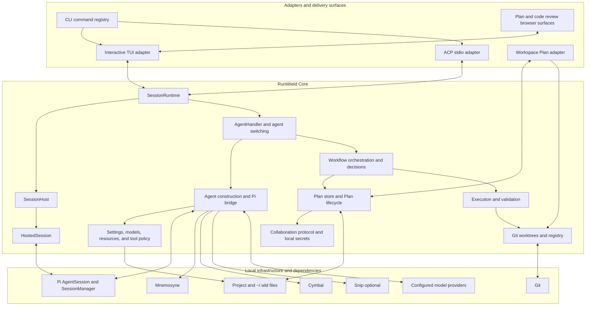

The session runtime is the application boundary for interactive conversations. Plan persistence and lifecycle form a
second core boundary used both by session workflows and by the Workspace. The workflow layer joins the two: it consumes
structured agent outcomes, calls Plan and execution services, and decides which agent owns the next step.

## Core boundary

| Area                        | Responsibilities                                                                                                     | Primary implementation                                                                                                                                   |
| --------------------------- | -------------------------------------------------------------------------------------------------------------------- | -------------------------------------------------------------------------------------------------------------------------------------------------------- |
| Session application runtime | Create/load/close sessions, serialize turns, switch agents, cancel work, emit semantic events, broker interactions   | `src/shared/session/session-runtime.js`                                                                                                                  |
| Per-session ownership       | Project root, root and sub-agent sessions, active agent/model/thinking state, workflow state, active interactions    | `src/shared/session/hosted-session.js`                                                                                                                   |
| Multi-session registry      | Adopt, find, list, and dispose hosted sessions                                                                       | `src/shared/session/session-host.js`                                                                                                                     |
| Pi integration              | Build configured `AgentSession` objects, assemble prompts, wire tools, translate Pi events, run prompts, reuse roots | `src/shared/session/session.js`                                                                                                                          |
| Workflow application logic  | Interpret tool outcomes, route requests, choose post-planning and post-execution actions                             | `src/shared/session/agent-handler.js`, `src/shared/workflow/orchestrator.js`, `src/shared/workflow/decisions.js`                                         |
| Plan domain                 | Canonical Markdown persistence, identities, hierarchy, lifecycle state machine, collaboration write lock             | `src/plan-store.js`, `src/shared/workflow/plan-lifecycle.js`                                                                                             |
| Execution domain            | Worktree preparation, Engineer completion gate, local validation, repair, merge-back, recovery metadata              | `src/shared/workflow/workflow.js`, `src/shared/workflow/validation.js`, `src/shared/worktree.js`                                                         |
| Configuration and policy    | Layered agent definitions, settings, model resolution, protected tools, skills/prompts/extensions                    | `src/shared/session/agents.js`, `src/shared/settings.js`, `src/shared/models/`, `src/tools/registry.js`                                                  |
| Local platform services     | Git probing, worktree registry, metrics, collaboration crypto/protocol/secrets, binary preflight                     | `src/shared/git.js`, `src/shared/worktree-registry.js`, `src/shared/workflow/metrics.js`, `src/shared/collaboration/`, `src/shared/runtime-preflight.js` |

Presentation details, terminal widgets, ACP wire types, HTTP routes, Astro/React components, and browser review
rendering are outside this boundary. They may call core services, subscribe to core events, or implement interaction
ports, but they should not become the authoritative owners of session or Plan state.

## Non-negotiable invariant

RunWield Core is a consumer-neutral engine.

- `SessionRuntime` is the only public boundary for live sessions.
- Consumers hold opaque Runtime session IDs, call Runtime methods, subscribe to Runtime events, and install semantic
  interaction adapters.
- Core never imports consumer code and contains no terminal, ACP, browser-review, widget, or presentation API
  vocabulary.
- Consumers never receive `HostedSession`, `SessionHost`, Pi `AgentSession`, or Pi `SessionManager` objects.
- Consumers cannot publish Runtime events. Event publication is private to `SessionRuntime` and the event sink it
  installs on internal sessions.
- Every engine-originated user message, assistant stream, thinking stream, tool lifecycle, system status, error,
  cancellation, and review request has one route across the boundary.

If Core were asked what a TUI or ACP server is, it would not know. It knows only commands, snapshots, semantic events,
and semantic interactions.

## Dependency direction

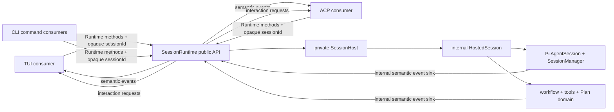

Forbidden edges are as important as the shown edges:

- Core must not import `src/ui/` or `src/acp/`.
- TUI, ACP, and commands must not import session host, hosted session, root-session, agent-handler, agent-switching, or
  the Pi session implementation.
- TUI and ACP must not publish events or obtain an internal session object.
- No compatibility re-export, optional UI argument, object-or-ID overload, or presentation fallback may recreate a
  forbidden edge.

## Public Runtime boundary

The public boundary lives in `src/shared/session/session-runtime.js`, `src/shared/session/session-runtime-events.js`,
and `src/shared/session/session-runtime-interactions.js`.

| Surface                 | Consumer-visible contract                                                                      |
| ----------------------- | ---------------------------------------------------------------------------------------------- |
| Identity                | Opaque Runtime `sessionId` strings                                                             |
| State                   | Immutable snapshots from `getSessionSnapshot()` and `listSessions()`                           |
| Lifecycle               | Create, load, replay, rename, close, resume inspection, and export methods                     |
| Turns                   | `promptSession()`, steering, deferred queue operations, cancellation, and compaction           |
| Agent state             | Agent switch, model reconfiguration, thinking level, and project-state context methods         |
| Workflows               | Planning, slicing, execution, approval, validation, and isolated-agent methods by ID           |
| Resources               | Prompt-template, skill, context-file, and expansion methods scoped through Runtime             |
| Local tools             | `runLocalShellCommand()` owns execution, transcript persistence, cancellation, and tool events |
| Output                  | `subscribeSessionEvents(sessionId, listener)`                                                  |
| Input requested by Core | `setInteractionAdapter()` and `requestInteraction()`                                           |

Snapshot field names keep two different workflow concepts explicit: `workflowContext` is the persisted
routing/complexity/declared-Plan context intended for consumers, while `activeExecutionWorkflow` is the live execution
state. They must not be collapsed into a generic `workflow` property.

Agent activation also has one path. Initial boot, resume, explicit consumer switches, and typed handoffs all commit a
matching root Agent Session and Agent Handler through the same private Runtime transaction. Consumers call
`switchAgent()` by opaque session ID; Runtime does not expose separate handler-installation or root-readiness phases.

`SessionRuntime` keeps its host, dependency implementations, listener maps, turn settlements, and queued-message state
in JavaScript private fields. The old object APIs (`createSession`, `adoptSession`, `getSession`), event-producer
escape, and raw handler injection do not exist.

## Single outward event path

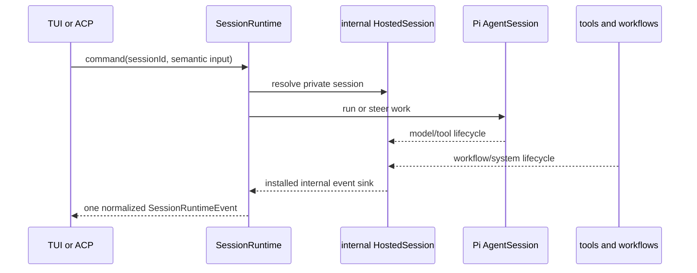

The Pi subscriber bridge is `attachSessionEventSubscribers()` in `src/shared/session/session.js`. It translates Pi
events into the shared vocabulary. `SessionRuntime` installs the hosted-session sink and privately adds identity,
timestamp, and turn context before fanout. No core producer receives a consumer presentation object.

### Flow map, one path at a time

| Workflow                            | Inbound path                                                    | Core path                                                                           | Outbound event or result                                                                         | Consumer action                                                                 |
| ----------------------------------- | --------------------------------------------------------------- | ----------------------------------------------------------------------------------- | ------------------------------------------------------------------------------------------------ | ------------------------------------------------------------------------------- |
| User message                        | `promptSession(id, { initialRequest, initialImages })`          | Runtime owns turn gate and handler dispatch                                         | `user_message`, `turn_start`, `busy_changed`                                                     | TUI appends user content; ACP sends chunks/state                                |
| Direct model/workflow operation     | Runtime action such as `runSlicerAgent()` or `compactSession()` | Runtime reference-counts nested busy operations                                     | one outer `busy_changed(true)` and one final `busy_changed(false)`                               | TUI animates while busy; other consumers receive the same aggregate state       |
| Assistant message stream            | Pi message update                                               | `attachSessionEventSubscribers()`                                                   | `assistant_text_delta` keyed by message ID                                                       | TUI appends to one message block; ACP sends `agent_message_chunk`               |
| Thinking stream                     | Pi thinking update/end                                          | same subscriber bridge                                                              | `assistant_thinking_delta`, `assistant_thinking_end`                                             | TUI owns thinking block; ACP sends `agent_thought_chunk`                        |
| Agent tool                          | Pi tool start/update/end                                        | same subscriber bridge                                                              | `tool_start`, `tool_update`, `tool_end` keyed by tool-call ID                                    | TUI owns one tool block; ACP sends one protocol tool lifecycle                  |
| Local `!` shell tool                | `runLocalShellCommand(id, options)`                             | Runtime spawns, tracks cancellation, optionally records transcript                  | one `tool_start`/updates/`tool_end`; optional `user_message`                                     | Same listeners as every other tool; TUI does not publish events                 |
| Protected workflow tools            | Pi invokes RunWield tool                                        | tool returns structured details and may emit semantic status/message                | tool lifecycle plus structured message-stream result                                             | Consumers render/map only the events                                            |
| Synthetic completion/review message | workflow calls helpers in `workflow-messages.js`                | Core emits a complete assistant delta with metadata                                 | `assistant_text_delta`                                                                           | TUI may style review result; ACP sends normal agent message                     |
| System status                       | Core calls `emitSystemStatus()`                                 | hosted event sink                                                                   | `system_status` with level and metadata                                                          | TUI shows status; ACP sends a status message chunk                              |
| Runtime or model error              | subscriber or Runtime catch                                     | error normalized inside Core                                                        | `terminal_error`; Runtime still closes turn with `turn_end` and `busy_changed(false)`            | TUI shows error; ACP reports protocol message/update                            |
| Cancellation                        | `cancelSession(id)`                                             | abort root, sub-agents, compaction, queued input, interactions, and local processes | one `cancellation` event with semantic scope/message; affected tools/interactions also terminate | Consumers render/map the event and clear local presentation state               |
| Steering                            | `steerSession(id, text, images)`                                | Runtime targets active root or records deferred message                             | `queued_message_changed` transitions                                                             | TUI updates queue display; ACP can ignore unsupported presentation state        |
| Replay/resume                       | `loadSession()` then `replaySession()`                          | Runtime translates persisted entries without exposing manager                       | the same normalized message, thinking, tool, usage, and status events used live                  | Consumer runs the same event handlers used for live output                      |
| Agent/model/thinking change         | Runtime setter/switch method                                    | Core rebuilds or updates owned root state                                           | `agent_changed`, `model_changed`, `thinking_level_changed`                                       | Consumers update labels/protocol metadata                                       |
| Workflow footer context             | `triage_report` or `plan_written`                               | Hosted session persists the normalized complete context                             | `workflow_context_changed`; `workflowContext` is also present in the Runtime snapshot            | TUI rerenders its footer; other consumers receive the same ready-to-use context |
| Session rename                      | `renameSession()` or workflow auto-name                         | Runtime/persisted manager                                                           | `session_renamed`                                                                                | TUI changes terminal title; ACP maps if supported                               |
| Plan/code review                    | Core requests `plan_review` or `code_review` interaction        | interaction broker tracks request and cancellation                                  | interaction lifecycle events plus normalized response                                            | TUI opens UI review adapter; ACP maps to protocol elicitation                   |

### TUI input translation

The TUI owns terminal key decoding. It translates only session-affecting intent into Runtime calls; editing and
navigation remain consumer-local. Core never receives key names or terminal escape sequences.

| Terminal input                   | Boundary behavior                                                                                                                                                                                         |
| -------------------------------- | --------------------------------------------------------------------------------------------------------------------------------------------------------------------------------------------------------- |
| Enter with text/images           | TUI calls `promptSession(id, options)`; Runtime publishes the user/turn/stream lifecycle                                                                                                                  |
| Escape                           | TUI calls `cancelSession(id)`; Runtime cancels interactions, compaction, agent work, queues, and processes and publishes one `cancellation` event; the key handler does not render a cancellation message |
| First Ctrl+C                     | Same Runtime cancellation call, then TUI clears editor/image preview state                                                                                                                                |
| Second Ctrl+C in the exit window | TUI-local process exit; no session command is implied                                                                                                                                                     |
| Up Arrow in an empty editor      | TUI first calls `dequeueLastQueuedMessage(id)` because queued session input is Runtime-owned; if none exists, the editor performs local history navigation                                                |
| Up/Down in a selector            | TUI-local selection navigation                                                                                                                                                                            |
| Typing, cursor movement, history | TUI-local editor state                                                                                                                                                                                    |

This prevents a key handler from becoming a second output producer. For example, Escape does not call a local
`appendSystemMessage()` after cancellation; `SessionRuntime` publishes the semantic cancellation event and the TUI/ACP
adapters decide how to represent that event.

The TUI adapter registry also enforces one adapter per `(SessionRuntime, sessionId)`. Attaching a second adapter fails;
session replacement must explicitly dispose the old registration before attaching the next one. It does not silently
deduplicate or replace subscribers.

### Turn settlement and errors

`HostedSession.beginTurn()` permits at most one active turn per Runtime ID. Different IDs run independently. Every
successful, failed, or canceled prompt releases the turn in `finally`, publishes `turn_end`, and publishes
`busy_changed(false)`. Chained `return_to_router` handoffs remain inside the same outer Runtime turn.

Runtime actions that can wait on model or workflow work use the same aggregate busy lifecycle even when they are not
entered through `promptSession()`. Busy ownership is reference-counted per Runtime session, so nested planning, Slicer,
execution, validation, isolated-agent, and compaction operations cannot publish an early idle transition. This keeps
animation and protocol state consumer-neutral: Core publishes `busy_changed`; a TUI may animate it, while Core knows
nothing about spinners or render timers.

Errors are data, not presentation calls. Core emits `terminal_error` or an error-level `system_status`; it never chooses
a widget, writes an ACP message, or calls a browser surface.

## Interactions and reviews

Interactions are the reverse side of the boundary: Core needs a semantic decision and a consumer supplies it.

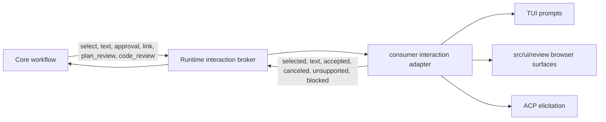

Core review logic lives in workflow modules and knows only the semantic request and response. Browser-aware plan/code
review implementations live under `src/ui/review/`. The TUI maps interactions in
`src/ui/tui/runtime-interaction-adapter.js`; ACP maps them in `src/acp/interaction-mapper.js`.

## Root cause of the duplicated TUI blocks

The duplicate was a presentation fanout bug, not duplicate model output and not duplicate persistence.

Historically, one Pi update had two independent routes to the same TUI:

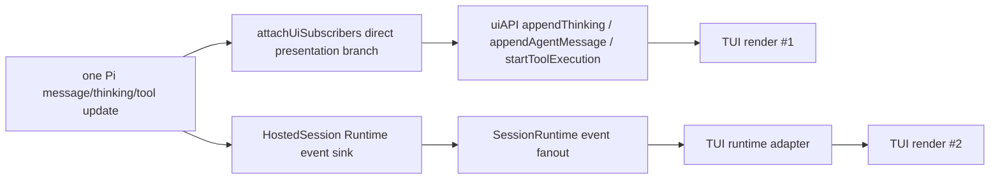

The former `attachUiSubscribers()` implementation in `src/shared/session/session.js` subscribed directly to Pi and
called presentation methods such as `appendThinkingStart()`, `appendAgentMessageStart()`, and `startToolExecution()`. At
the same time it emitted semantic Runtime events. The TUI had also attached `runtime-adapter.js`, so that adapter
rendered the same semantic update again.

The former `session-runtime-ui.js` did not remove the second route. It translated legacy presentation calls back into
Runtime events and used a `_runtimeEventBridge` marker to conditionally suppress direct output. Session construction,
root replacement, reload, and workflow call sites did not all carry the same presentation object, so the marker was not
a stable architectural guarantee. A call path that received the raw presentation API re-enabled direct rendering.

Tool starts often looked correct because the TUI adapter deduplicated them by `toolCallId` and active block. Assistant
and thinking blocks were created independently on the two routes, so they visibly doubled. Pi persisted one assistant
message, which is why the transcript on disk contained one message while the screen showed two.

The seam kept returning because earlier fixes guarded or deduplicated one branch while retaining both branches and the
legacy port. The durable fix is the current graph:

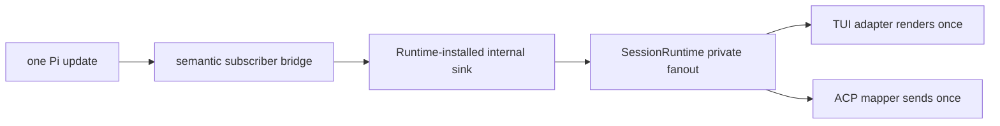

There is no direct subscriber presentation branch, no core presentation API, no Runtime UI bridge, and no consumer
event-publisher method.

## Session runtime

### Ownership hierarchy

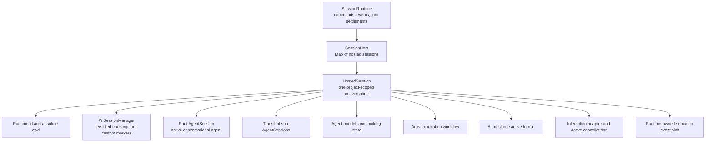

`SessionRuntime` owns application operations and event subscriptions. `SessionHost` is deliberately small: it owns a map
of `HostedSession` instances and their disposal. `HostedSession` is the mutable state container for one live,
project-scoped conversation.

The important ownership rule is that mutable interactive state belongs to a `HostedSession`, not to module-level
globals. This includes the root agent, transient sub-agents, current model, thinking level, active execution worktree,
pending interactions, and turn ownership.

### Session identities

Several identifiers coexist and must not be treated as interchangeable:

| Identity                        | Purpose                                                                  | Lifetime                         |
| ------------------------------- | ------------------------------------------------------------------------ | -------------------------------- |
| `HostedSession.id`              | In-process runtime lookup and event routing                              | One live hosted instance         |
| `SessionManager.getSessionId()` | Durable Pi transcript identity under `~/.wld/sessions/`                  | Persists across process restarts |
| ACP session id                  | Protocol-facing handle mapped by `AcpSessionMap`                         | ACP connection/session lifetime  |
| Plan `planId`                   | Durable project-scoped resource identity for Workspace and collaboration | Stored in Plan front matter      |

Consumers receive only the opaque Runtime session ID returned by `SessionRuntime`. The private host stores that ID on
the internal `HostedSession`; persistence retains its own Pi identity. ACP adds a protocol-facing mapping on top.
Consumers never infer identities or receive the host, hosted session, session manager, or Pi agent object.

### Persisted and transient state

| State                                             | Owner                                    | Persistence                                                                                    |
| ------------------------------------------------- | ---------------------------------------- | ---------------------------------------------------------------------------------------------- |
| Messages, model/thinking changes, session name    | Pi `SessionManager`                      | Append-only session stream                                                                     |
| Active RunWield agent                             | Custom `runwield.active_agent` entry     | Session stream                                                                                 |
| Routing/complexity/Plan footer context            | Custom `runwield.workflow_context` entry | Session stream                                                                                 |
| Root `AgentSession` and subscribers               | `HostedSession`                          | Live memory only; rebuilt from persisted context                                               |
| Active execution workflow                         | `HostedSession`                          | Live memory; recovery evidence is separately stored in Plan front matter and worktree registry |
| Interaction requests and cancellation controllers | `HostedSession`                          | Live memory only                                                                               |
| Runtime event listeners                           | `SessionRuntime`                         | Live memory only                                                                               |

Session loading is guarded by both id and project root. A supplied file path must remain inside the encoded session
directory for that project, and the opened `SessionManager` must report the requested cwd. Replay converts the current
persisted branch into semantic runtime events before the adapter takes over live streaming.

### Turn execution

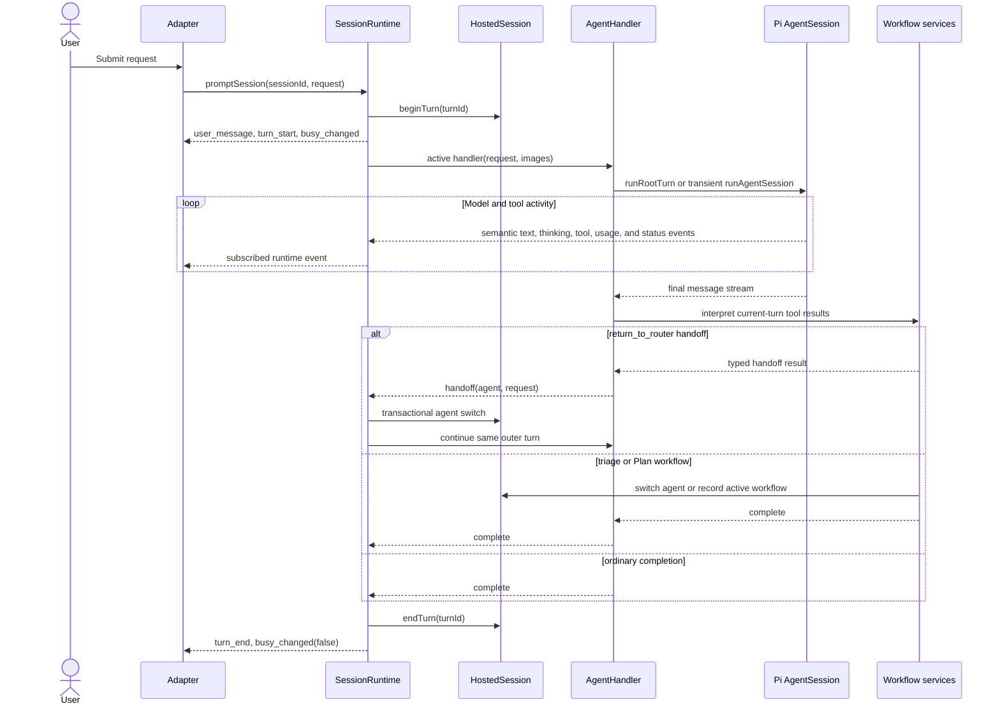

`HostedSession.beginTurn()` is the concurrency gate. A second prompt for the same hosted session raises
`SessionTurnInProgressError`; different hosted sessions can progress independently. A `return_to_router` outcome is a
typed handoff handled inside the same outer turn, with a maximum of four chained handoffs.

Agent switching is transactional. The target root session is built before the active handler is replaced, so a build
failure leaves the previous root/handler pair intact. Root reuse preserves conversational context while the same agent
and root-affecting configuration remain active.

### Root and sub-agent lifetimes

- The root `AgentSession` is the persistent conversational agent for the current topic.
- `ensureRootAgentSession()` builds a replacement before detaching the old root's RunWield subscribers.
- Agent/model/reload rebuilds intentionally do not dispose the old root object. Explicit `/new` owns root disposal.
- Workflow-only calls can use transient sub-agent sessions. They are registered on `HostedSession`, unsubscribed, and
  disposed in `finally` blocks.
- Cancellation aborts the root prompt, all tracked sub-agent prompts, active interaction requests, and validation
  processes registered as interactions.
- `closeSessionWhenIdle()` cancels an active turn, awaits its settlement, and only then disposes session-owned state.

### Runtime events and interactions

`session-runtime-events.js` defines the adapter-neutral event vocabulary. It covers:

- session creation, loading, closing, replay, and renaming;
- user messages, assistant text/thinking deltas, and usage;
- tool start/update/end;
- agent, model, thinking, busy, input, and running-task changes;
- turn start/end, cancellation, terminal errors, and system status;
- interaction lifecycle, attention requests, and Plan review links.

Core producers write semantic events to the sink installed on the internal hosted session. `SessionRuntime` is the only
outward publisher: it adds session, timestamp, and turn context, then fans each event out to subscribers. Event
listeners are failure-isolated so one consumer cannot crash the engine, but there is no second presentation route.

Runtime events are consumer-ready semantic records, not bags of provider fragments. The boundary supplies stable message
identity, agent identity, levels, headers, normalized usage, and complete tool descriptors. A consumer may map those
fields into its own widgets or wire protocol, but it must not infer missing identity, rebuild a title from tool
arguments, normalize provider usage, correlate metadata hidden in `_meta`, or turn arbitrary objects into display text.

The tool lifecycle is deliberately self-sufficient:

| Event         | Runtime-owned fields                                                                                                                              | Consumer responsibility               |
| ------------- | ------------------------------------------------------------------------------------------------------------------------------------------------- | ------------------------------------- |
| `tool_start`  | tool-call ID, stable tool name, semantic kind, view-ready title, raw arguments                                                                    | Create exactly one tool presentation  |
| `tool_update` | the same stable identity, complete structured content snapshot, complete text projection, structured details                                      | Replace the presentation content      |
| `tool_end`    | the same stable identity and complete result, error state, Runtime-measured duration or explicit `null` when persisted history cannot provide one | Mark that exact presentation complete |

Live Pi tools, local `!` shell commands, validation commands, and replay all use the same descriptor and result
normalizers before publication. Structured image content and truncation/full-output details survive the boundary; text
surfaces use the supplied `output` projection without flattening the structured blocks themselves. Replay does not emit
a generic raw-entry fallback. Initial persisted model/thinking assignments and the internal active-agent marker update
replay state but do not become status blocks; only later actual setting changes are visible.

`createSessionRuntimeEvent()` validates the contract at publication. Missing tool titles, kinds, complete output,
durations, message identity, or other required semantic fields fail at the Core boundary. Adapter listener failures are
isolated after validation; producer contract failures are not mislabeled and swallowed as adapter failures.

Interactions travel in the opposite direction. Core asks for a semantic selection, text, approval, link, plan review, or
code review. The installed consumer adapter returns a normalized outcome. The broker records active interactions on the
hosted session so cancellation and disposal can abort them.

## Agent construction and policy

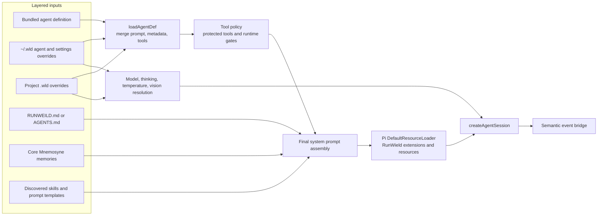

### Layering rules

Agent definitions are loaded from bundled defaults, then home overrides, then project overrides. Higher layers replace
scalar front matter. Prompt bodies append unless a higher layer sets `promptOverride: true`. A higher-layer `tools`
array replaces the lower one, but protected workflow/code/memory tools present in the lowest existing definition are
re-added so an override cannot silently remove a Core invariant.

At invocation time:

1. an explicit `toolNames` list may narrow, but not widen, the agent definition's tool set;
2. runtime custom tools are added explicitly;
3. `return_to_router` is removed unless the invocation permits it;
4. named RunWield tools such as `triage_report`, `plan_written`, `task_completed`, and `user_interview` are wired to
   concrete implementations;
5. RunWield replaces selected built-ins with guarded variants such as grep and edit fallback.

### Prompt and model assembly

The final prompt combines the core system template, merged agent prompt, effective tool descriptions, global and project
instructions, project-state context, core memories, available skills, image-fallback guidance, bundled resource paths,
and timezone.

Model selection uses RunWield-owned settings and model/auth files under `~/.wld`. Settings can choose per-agent models,
presets, provider defaults, thinking levels, temperatures, and a vision fallback. Model/provider state is mirrored onto
the hosted session for adapters, while Pi owns the active model on each `AgentSession`.

Mnemosyne and Cymbal are hard preflight requirements for agent construction. Snip is optional and its extension is
registered only when available. The resource loader disables Pi's implicit context/prompt discovery so RunWield can
apply its own explicit precedence and policy.

## Workflow orchestration

RunWield does not infer workflow progress from assistant prose. Protected tools write structured results into the agent
message stream, and `AgentHandler` examines only the current turn's new messages to avoid replaying a stale outcome.

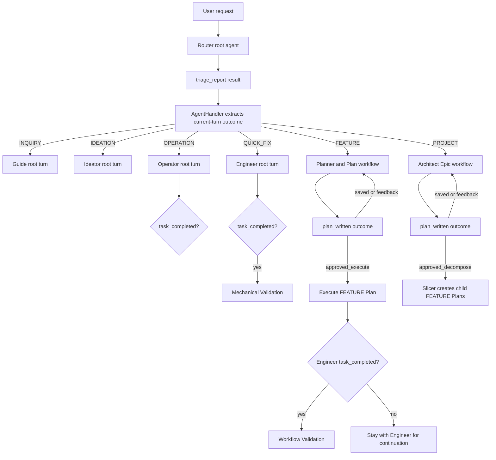

The six routing intents have distinct ceremony:

- `INQUIRY` and `IDEATION` switch to a specialist and preserve that specialist as the root agent.
- `OPERATION` is direct non-code work. It observes `task_completed` but performs no mechanical validation.
- `QUICK_FIX` is direct code work with no Plan or worktree. `task_completed` gates Mechanical Validation.
- `FEATURE` creates and reviews a Plan, then executes only after readiness.
- `PROJECT` creates an Epic container. It is decomposed into child FEATURE Plans and is never executed directly.

`workflow-results.js` extracts structured outcomes. `decisions.js` converts them into semantic actions such as
`execute_plan`, `start_slicer`, `run_validation`, `stay_with_agent`, or `halt`. Callers retain responsibility for state
mutation, user interaction, recovery, and agent switching.

## Plan domain

### Canonical Plan representation

`plans/**/*.md` is the source of truth. A Plan consists of a YAML front matter record plus a Markdown body. The store:

- guards Plan names against absolute paths and `..` traversal;
- normalizes known metadata while preserving supported Plan fields;
- assigns durable `planId` values for resource lookup;
- models Epic/child relationships and sibling dependencies;
- supports active, archived, restored, local, external, and shared Plans;
- enforces the remote-canonical collaboration lock before ordinary writes;
- provides body-hash optimistic concurrency for Workspace body edits.

Plan body optimistic concurrency is narrower than the whole store: lifecycle/front-matter operations and many workflow
writes currently read and rewrite the Markdown file directly, while body edits by `planId` compare an expected SHA-256
hash first.

### Lifecycle state machine

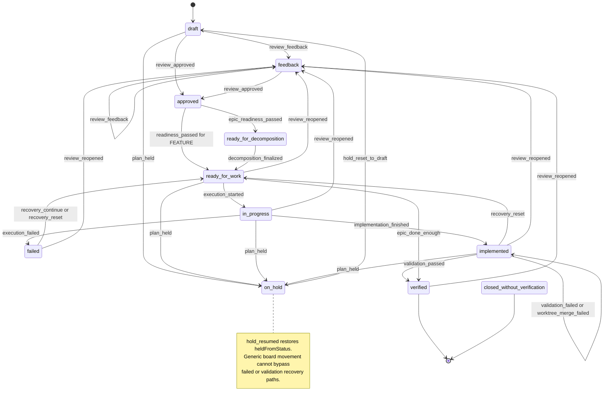

This diagram shows primary and recovery paths. The complete allowed-from matrix lives in
`src/shared/workflow/plan-lifecycle.js`, including constrained manual board movement and manual closure without
verification.

The lifecycle module is the authority for status transitions. Callers emit a named Plan Event; the state machine checks
the source status and builds all related metadata updates. Examples include timestamps, failure details, worktree
identity, hold metadata, and human-review evidence. A verified child can automatically advance its parent Epic once all
siblings are verified.

Plan lifecycle persistence and collaboration locking are intentionally joined: `recordPlanEvent()` writes through the
Plan store, and a remote-canonical shared Plan rejects an ordinary local status mutation with a collaboration-specific
repair error.

## Execution, validation, and worktrees

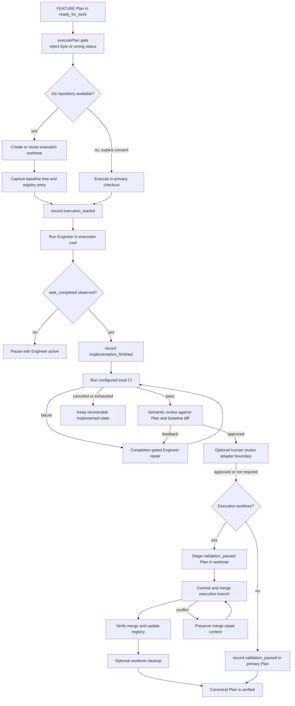

### Execution invariants

- Only a Plan in `ready_for_work` can start execution.
- PROJECT Epics are containers and cannot execute.
- The project root remains the owner of Plan metadata; file tools run in the execution cwd.
- With Git, execution uses a registered worktree and a captured baseline tree.
- Without Git, in-place execution requires remembered, scope-specific user consent.
- Engineer output is not completion. The protected `task_completed` tool is the completion gate.
- Workflow Validation begins from `implemented`, not directly from `in_progress`.
- A Git-backed Plan becomes canonically `verified` through the worktree merge, so Plan verification evidence and code
  changes land together.
- Merge and validation failures preserve worktree/Plan metadata for recovery instead of discarding the execution state.

### Worktree ownership

`startActiveExecutionWorkflow()` creates or reuses a worktree, captures its baseline tree, records the target branch,
stores the live workflow on the hosted session, updates `.wld/worktrees.json`, and records `execution_started` in the
Plan.

`worktree.js` owns branch resolution, worktree creation, dirty-path risk checks, committing execution changes,
merge-back, detached target-branch merge worktrees, merge-repair metadata, and cleanup. The worktree registry has a
best-effort lock file with stale-lock detection. The Plan front matter contains the durable recovery pointer; the
registry tracks local operational state.

### Validation modes

Mechanical Validation is the narrow QUICK_FIX path: configured local CI plus up to three completion-gated Engineer
repair attempts. It has no Plan lifecycle, semantic review, review UI, worktree merge, or registry mutation.

Workflow Validation is the Plan path: local CI, implementation-diff checks, semantic review, repair loops, optional
human code review, and merge-back. Browser code review is an adapter at one point in this larger core workflow; the
validation loop owns whether the result is sufficient to continue.

## Configuration and extension services

### Settings

Settings are split between `~/.wld/settings.json` and `<project>/.wld/settings.json`. Project values override global
values; object-valued custom settings receive a shallow top-level merge. A project-root-keyed cache owns Pi
`SettingsManager` instances. Writes use `proper-lockfile`, and RunWield-specific keys are preserved when Pi writes its
known settings schema.

Legacy Pi settings, model definitions, and authentication can be imported once into RunWield-owned storage. Runtime
reads do not continue falling back to Pi after migration.

### Catalogs and resources

The runtime resolves:

- agent definitions from project, home, and bundled layers;
- prompt templates from project, home, bundled, and installed package resources;
- skills from project, home, bundled, package, and optionally external ecosystems;
- RunWield extension manifests and package-provided prompt resources;
- project/global instruction files with explicit RunWield precedence.

Catalog APIs accept a project root and are tested for isolation between two roots. Some helper APIs still retain
`Deno.cwd()` defaults for CLI convenience; explicit project-root propagation is therefore an architectural invariant at
the higher runtime boundary rather than a universally enforced low-level type.

### Metrics and fail-open services

Workflow metrics are opt-in JSONL under `~/.wld/workflow-metrics/<encoded-cwd>/metrics.jsonl`. They hash cwd, redact
prompts, output, secrets, and paths, and fail open so telemetry cannot stop a workflow. Session footer-context markers,
event listeners, extension warnings, and selected cleanup paths are also fail-open. In contrast, missing Mnemosyne or
Cymbal is a hard agent-construction failure, and invalid lifecycle/worktree gates are hard workflow failures.

## Persistence map

| Data                                      | Location                                                          | Authority and write behavior                         |
| ----------------------------------------- | ----------------------------------------------------------------- | ---------------------------------------------------- |
| Session transcript                        | `~/.wld/sessions/<encoded-project-root>/`                         | Pi `SessionManager`; guarded load by cwd/id/path     |
| Session image and memory-backup artifacts | Beside the persisted session                                      | Session-scoped file helpers                          |
| Global settings, models, auth             | `~/.wld/`                                                         | RunWield settings/model services                     |
| Project settings and overrides            | `<project>/.wld/`                                                 | Project-scoped settings/catalog services             |
| Plans                                     | `<project>/plans/**/*.md`                                         | Plan store and Plan lifecycle                        |
| Archived Plans                            | `<project>/plans/archived/`                                       | Plan store archive/restore operations                |
| Worktree registry                         | `<project>/.wld/worktrees.json`                                   | Worktree registry under a local lock file            |
| Execution worktrees                       | `~/.wld/worktrees/<encoded-project-root>/` by default             | Git worktree service                                 |
| Workflow metrics                          | `~/.wld/workflow-metrics/<encoded-project-root>/metrics.jsonl`    | Optional, sanitized, fail-open append                |
| Collaboration secrets                     | `~/.wld/collaboration-secrets.json` or project-local ignored file | Atomic temp-file/rename with restrictive permissions |

## Adapters over Core

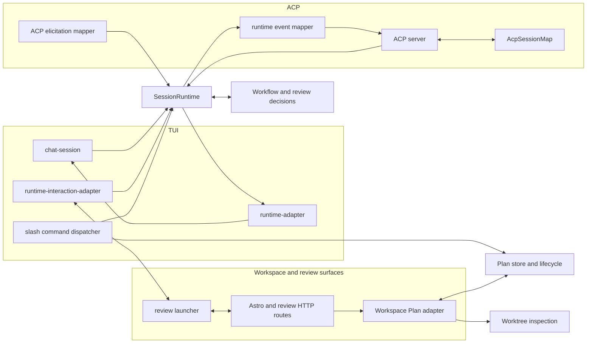

### TUI adapter

The TUI creates one `SessionRuntime`, retains opaque Runtime session IDs, and never constructs or receives a
`SessionHost`, `HostedSession`, Pi `SessionManager`, or Pi `AgentSession`. `runtime-adapter.js` renders semantic events
into terminal blocks, while `runtime-interaction-adapter.js` implements selection, text, approval, and browser review
interactions.

Natural-language turns and live-session slash commands call public `SessionRuntime` methods. Commands that operate on
non-session application domains may call those public Plan or configuration services directly; they do not reach into
live-session internals.

### ACP adapter

The ACP server calls public `SessionRuntime` methods with Runtime IDs. `AcpSessionMap` maps protocol IDs to opaque
Runtime IDs and never stores hosted or Pi objects. Runtime events become ACP `session/update` notifications, and ACP
client elicitation implements the same semantic interaction contract.

ACP currently supports the MVP session methods and rejects unsupported methods explicitly. It contains protocol
validation and mapping only; it does not own agent, workflow, or persistence state.

### Workspace and review adapters

The Workspace is not currently a `SessionRuntime` client. Its server-only Plan adapter calls the Plan store, lifecycle,
and worktree inspection services directly, then projects domain records into board/detail HTTP shapes. Lifecycle writes
still pass through `recordPlanEvent()`, and body saves use Plan body hashes.

Plan and code review browser servers are launched by the consumer interaction implementation under `src/ui/review/`. The
launcher returns a URL, a decision promise, and a stop function. Core workflow code owns the semantic request and what
the normalized decision means; the browser surface owns rendering and human input.

## Current architectural seams

These remaining seams are operational characteristics, not exceptions to the session consumer boundary:

1. **Project-root propagation is strong but not universal.** Runtime entry points require absolute roots, and most
   workflow services accept explicit roots. Some settings, package-resource, extension, Git-consent, and CLI helpers
   still default to process cwd.
2. **Root replacement has a specialized lifetime rule.** Replacement unsubscribes the previous root but does not dispose
   it; `/new` is the explicit disposal boundary. Tests distinguish subscriber detachment, prompt cancellation, object
   disposal, and session-manager disposal.
3. **Active workflow state is split across memory and durable recovery evidence.** `HostedSession` owns live execution
   context; Plan front matter and the worktree registry retain enough evidence for later recovery.
4. **Persistence concurrency differs by store.** Settings and the worktree registry use locks, collaboration secrets use
   atomic rename, Workspace Plan body edits use optimistic hashes, and general Plan lifecycle/front-matter writes are
   direct file rewrites.
5. **Failure policy is deliberately mixed.** Runtime listener isolation, metrics, context markers, and selected cleanup
   paths fail open; preflight requirements, Plan transition guards, project-root checks, and worktree safety gates fail
   closed.
6. **The command registry spans session and non-session domains.** Live-session actions use `SessionRuntime`; Plan,
   settings, and catalog commands can call their own public application services. Neither path exposes live-session
   internals.

## Folder organization and enforcement

Moving the TUI to `src/ui/` was directionally correct but could not enforce dependency direction. A file in Core could
still import a UI type or accept an abstract presentation object, and a file in `src/ui/` could still import internal
session objects. Folder names express intent; the import graph and public API enforce architecture.

The current layout is:

| Folder                               | Role                                                        | Allowed dependency direction                                  |
| ------------------------------------ | ----------------------------------------------------------- | ------------------------------------------------------------- |
| `src/shared/session/`                | Runtime boundary plus private session engine implementation | May depend on other Core modules; never consumers             |
| `src/shared/workflow/`, `src/tools/` | Consumer-neutral workflow and tool engine                   | May emit through internal session sink; never render          |
| `src/ui/tui/`                        | TUI event/interaction consumer                              | Runtime public modules and UI code only; no session internals |
| `src/acp/`                           | ACP event/interaction consumer                              | Runtime public modules and ACP protocol code only             |
| `src/ui/review/`                     | Browser review interaction implementation                   | UI/review infrastructure; Core does not import it             |
| `src/cmd/`                           | CLI/TUI command consumers                                   | Runtime public surface; no hosted/root/handler internals      |

`src/shared/session/architecture-boundary.test.js` makes these rules executable in CI. It scans production files and
fails on consumer vocabulary/imports in Core, internal session imports in consumers, host/object escape hatches,
consumer event publication, and removed compatibility files returning.

A future physical split into `src/core/` and `src/adapters/` could make the layout even more obvious, but it must be a
real move with no compatibility re-exports. It is not the enforcement mechanism. The private Runtime surface and the CI
dependency guard are what prevent this seam from silently returning.

## Verification map

| Invariant                                              | Principal coverage                                                                  |
| ------------------------------------------------------ | ----------------------------------------------------------------------------------- |
| Core knows no consumers; consumers use only Runtime    | `src/shared/session/architecture-boundary.test.js`                                  |
| Opaque IDs and private internals                       | `src/shared/session/session-runtime.test.js`                                        |
| One ordered turn lifecycle and error settlement        | `src/shared/session/session-runtime.test.js`                                        |
| One Pi text/thinking/tool translation                  | `src/shared/session/session-subscribers.test.js`                                    |
| Consumer-ready event identity, usage, and tool data    | `src/shared/session/session-runtime-events.test.js`                                 |
| One shared tool title and semantic-kind implementation | `src/shared/session/tool-event-title.test.js`                                       |
| TUI and ACP consume the same transcript                | `src/ui/tui/runtime-adapter.test.js`, `src/acp/event-mapper.test.js`                |
| Duplicate TUI adapter attachment fails until disposal  | `src/ui/tui/runtime-adapter.test.js`                                                |
| Local shell is Runtime-owned                           | `src/shared/session/session-runtime.test.js`, `src/ui/tui/bash-interceptor.test.js` |
| Semantic interactions and cancellation                 | `src/shared/session/session-runtime.test.js`, adapter interaction tests             |
| Workflow tools emit messages/events without UI ports   | tool tests under `src/tools/__tests__/`                                             |
| CI, system status, errors, reviews, repair, merge      | `src/shared/workflow/validation.test.js`                                            |
| Routing, planning, slicing, execution                  | `src/shared/workflow/orchestrator.test.js`, `src/shared/workflow/workflow.test.js`  |

## Current automated-test map

This is a location map, not a claim of sufficient coverage. Test counts alone do not establish stability; the important
question is whether invariants hold across module boundaries, cancellation/error paths, persistence, and real process or
Git behavior.

| Core area                    | Principal test suites                                                                                                                 | Existing emphasis                                                                               |
| ---------------------------- | ------------------------------------------------------------------------------------------------------------------------------------- | ----------------------------------------------------------------------------------------------- |
| Hosted state and registry    | `hosted-session.test.js`, `session-host.test.js`                                                                                      | Ownership, isolation, disposal, active turn and interaction state                               |
| Runtime lifecycle            | `session-runtime.test.js`, `root-session.test.js`, `active-agent-session.test.js`, `workflow-context-session.test.js`                 | Create/load/replay, prompt serialization, handoffs, close/cancel, persisted markers             |
| Agent/Pi bridge              | `session-prompt.test.js`, `session-subscribers.test.js`, `agent-switching.test.js`, `session-catalog.test.js`                         | Root reuse/rebuild, event translation, prompt assembly, project-root catalog isolation          |
| Agent workflow handler       | `agent-handler.test.js`, `orchestrator.test.js`, `decisions.test.js`, `workflow-results` coverage inside workflow tests               | Current-turn outcome extraction, routing, dispatch, completion gates, semantic decisions        |
| Plan persistence and state   | `plan-store.test.js`, `plan-lifecycle.test.js`, `src/ui/review/plan-review.test.js`, `plan-written.test.js`                           | Front matter, hierarchy, identity, locks, transition matrix, readiness and submission outcomes  |
| Execution and validation     | `workflow.test.js`, `validation.test.js`, `git-snapshot.test.js`                                                                      | Worktree setup, completion gate, CI/review/repair/merge paths, lifecycle evidence               |
| Git worktrees                | `worktree.test.js`, `worktree-registry.test.js`, `git.test.js`                                                                        | Real/temp Git operations, branch targets, merge safety, recovery metadata, non-Git behavior     |
| Configuration and policy     | `settings.test.js`, `model-registry.test.js`, `model-validation.test.js`, `runtime-preflight.test.js`, `session-tools-policy.test.js` | Layering, migration, locking, model discovery, protected-tool and binary policy                 |
| Collaboration primitives     | Tests under `src/shared/collaboration/`                                                                                               | Crypto, capabilities, protocol normalization, locks, secrets, client behavior                   |
| Adapter/boundary conformance | `src/shared/session/architecture-boundary.test.js`, ACP tests, TUI runtime-adapter tests, Workspace tests                             | Dependency direction, protocol mapping, single event consumption, interactions, Plan projection |

The highest-value cross-boundary paths for later confidence analysis are visible in the diagrams above:

- adapter request -> runtime turn ownership -> Pi prompt -> runtime event ordering -> adapter completion;
- structured tool result -> workflow decision -> agent switch -> continued root context;
- Plan Event -> Markdown write -> reload -> recovery decision;
- execution start -> worktree/baseline/registry/Plan metadata agreement;
- cancellation or failure at every await boundary -> settled turn and recoverable durable state;
- validation success -> staged Plan evidence -> merge-back -> canonical verified state.

## Source guide

| Concern                                   | Start here                                                                    |
| ----------------------------------------- | ----------------------------------------------------------------------------- |
| Runtime API and turn loop                 | `src/shared/session/session-runtime.js`                                       |
| Per-session state                         | `src/shared/session/hosted-session.js`                                        |
| Session registry                          | `src/shared/session/session-host.js`                                          |
| Runtime event contract                    | `src/shared/session/session-runtime-events.js`                                |
| Interaction contract                      | `src/shared/session/session-runtime-interactions.js`                          |
| Pi session construction and prompt bridge | `src/shared/session/session.js`                                               |
| Agent definition layering                 | `src/shared/session/agents.js`                                                |
| Agent switching                           | `src/shared/session/agent-switching.js`                                       |
| Workflow-aware turn handling              | `src/shared/session/agent-handler.js`                                         |
| Routing orchestration                     | `src/shared/workflow/orchestrator.js`                                         |
| Workflow decisions and outcome parsing    | `src/shared/workflow/decisions.js`, `src/shared/workflow/workflow-results.js` |
| Plan execution facade                     | `src/shared/workflow/workflow.js`                                             |
| Validation and repair                     | `src/shared/workflow/validation.js`                                           |
| Plan lifecycle                            | `src/shared/workflow/plan-lifecycle.js`                                       |
| Plan persistence                          | `src/plan-store.js`, `src/plan-front-matter.js`                               |
| Worktree operations and registry          | `src/shared/worktree.js`, `src/shared/worktree-registry.js`                   |
| Settings and models                       | `src/shared/settings.js`, `src/shared/models/`                                |
| Tool policy                               | `src/tools/registry.js`, agent front matter in `src/agent-definitions/`       |
| TUI adapter                               | `src/ui/tui/chat-session.js`, `src/ui/tui/runtime-adapter.js`                 |
| ACP adapter                               | `src/acp/server.js`, `src/acp/session-map.js`, mapper modules in `src/acp/`   |
| Workspace Plan adapter                    | `src/ui/workspace/server/plan-adapter.js`                                     |
| Review consumer surface                   | `src/ui/review/review-launcher.js`, `src/review-workspace-server.js`          |
