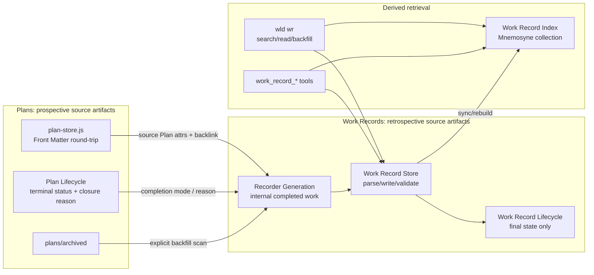
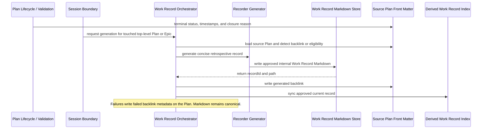

# Work Records V1

## Context

RunWield has durable prospective artifacts — Plans, PRDs, ADRs, Plan lifecycle metadata, validation state, and memory —
but it lacks a concise, durable record of what completed planned work actually produced. Old Plans are useful evidence,
but they can be misleading future planning context because they describe intent rather than final outcome, completion
confidence, done-enough Epic scope, skipped verification, or later supersession.

`docs/prd/work-records-prd.md` is the product design source for the broader Work Records concept. For this Epic, the
accepted V1 scope is **internal automatic Work Records only**: completed top-level RunWield Plans/Epics can generate
approved Work Records, existing completed Plans can be backfilled, and planning Agents can search/read approved current
records. Full manual/external creation, `wld wr create`, Recorder-led interviews for outside work, and Plannotator Work
Record approval are deferred to a separate feature. Guided Review reuse is also deferred, but the V1 architecture should
leave a clean seam for a future shared review-intelligence packet and pending-verification records.

Canonical domain language is already present in `CONTEXT.md`: Work Record, Draft Work Record, Pending Verification Work
Record, Superseded Work Record, Archived Work Record, External Work Record, Work Record Provenance, Recorder, and Work
Record Search Tool. No context-language change is expected unless implementation discovers a vocabulary mismatch; record
that as follow-up rather than expanding the scope of this Epic.

## Objective

Add Work Records to RunWield Core as repo-local Markdown artifacts under `docs/work-records/`, with Markdown as the
source of truth and Mnemosyne/search state treated as rebuildable derived state.

V1 establishes these system capabilities:

- canonical Work Record parsing, validation, path/slug handling, lifecycle state, and Markdown read/write boundaries;
- Plan Front Matter extensions for Work Record backlinks and required closed-without-verification reasons;
- automatic internal generation for completed **top-level** FEATURE Plans and PROJECT Epics only;
- explicit `wld wr` read/search/backfill flows over canonical records and eligible completed Plans;
- a derived Work Record search index isolated from normal project memory;
- `work_record_search` and `work_record_read` tools for Guide, Ideator, Planner, Architect, and Recorder, while keeping
  Engineer without default Work Record retrieval;
- best-effort session-boundary generation that never blocks Plan terminal transitions, `/new`, or `/quit`;
- documentation and settings describing Work Record storage, completion confidence, backfill, indexing, and automatic
  generation.

The high-level dependency direction should keep Plan storage/lifecycle independent of Work Record generation. Plan
modules may store neutral backlink metadata and closure reasons, but Work Record modules own eligibility, generation,
validation, indexing, and search semantics.

## Vertical Slice Findings

The relevant current architecture has clear seams, but the Epic crosses several ownership boundaries:

- `src/plan-store.js` owns Plan Front Matter parsing/injection, Plan listing, archived Plan listing, hierarchy helpers,
  and arbitrary Plan Front Matter updates through `updatePlanFrontMatter()`. Work Record backlinks and closure reasons
  should be known Plan Front Matter fields here so active and archived Plans round-trip predictably.
- `src/plan-front-matter.js` centralizes Plan key ordering. New Plan fields should be ordered with lifecycle/completion
  metadata rather than falling through as arbitrary unknown keys.
- `src/shared/workflow/plan-lifecycle.js` owns Plan Events through `recordPlanEvent()` and `buildPlanEventUpdates()`.
  `manual_closed_without_verification` already exists, but it currently lacks a reason contract. V1 should enforce the
  non-empty reason at this lifecycle/API boundary and persist it as `closedWithoutVerificationReason`; old
  already-closed Plans without the field remain valid backfill inputs and use `Reason not specified.`.
- Workspace lifecycle actions in `src/ui/workspace/server/plan-adapter.js` route manual close-without-verification
  through the same lifecycle event, including an in-memory preview path. Frontend scope is required so that reason
  collection, validation errors, and Plan detail/backlink presentation remain coherent in browser surfaces.
- `src/shared/workflow/validation.js` records successful validation with `validation_passed`; it is the strongest
  workflow-adjacent seam for marking a Plan terminal without embedding Work Record generation in the validation critical
  path. Work Record generation should observe terminal outcomes later rather than make validation depend on Recorder or
  Mnemosyne.
- `src/shared/session/session-runtime.js`, `/new`, and `/quit` are the current session-boundary control points.
  `closeSessionWhenIdle()` and `closeAllSessionsWhenIdle()` already protect active turns before disposal. V1 should hook
  best-effort Work Record scheduling before replacing or closing a session, scoped to top-level Plans/Epics touched by
  that session, not broad repository scanning.
- `src/cmd/registry.js` is the central command registry. `wld wr` should follow the `wld plans` command-group pattern:
  registry metadata, command-specific parsing modules under `src/cmd/wr/`, help output, and tests.
- Agent tools are declarative in bundled Agent Definition front matter and auto-wired in `buildAgentSession()` when a
  named internal custom tool is requested. Work Record tools should use this path rather than becoming generic Mnemosyne
  tools or prompt-only instructions.
- `src/tools/registry.js` protects core context tools from layered-agent removal when present in bundled definitions.
  Work Record search/read are planning-context tools; if added to the bundled definitions for Guide/Ideator/Planner/
  Architect/Recorder, they should be protected for those Agents, while Engineer simply does not list them.
- `docs/work-records/` does not exist yet as canonical storage. The first implementation should make directory creation
  and empty-directory behavior explicit without treating any index or cache as canonical.

The critical V1 data flow is:

## Files to Modify

- `docs/prd/work-records-prd.md` — align V1 acceptance with the resolved scope: internal automatic Work Records are in
  this Epic; manual/external creation and Guided Review reuse are deferred while their schema/lifecycle seams remain.
- `src/constants.js` — add any durable constants needed for Work Records, such as a Work Record storage directory name,
  command label, and Recorder Agent identifier if V1 uses a first-class bundled `recorder.md` Agent Definition.
- `src/plan-front-matter.js` — add stable Plan Front Matter ordering for `closedWithoutVerificationReason` and
  `workRecord` backlink metadata.
- `src/plan-store.js` — parse, normalize, format, and update the new Plan fields for active and archived Plans; preserve
  unknown existing metadata; keep file path separate from Plan identity and Work Record identity.
- `src/shared/workflow/plan-lifecycle.js` — enforce non-empty close-without-verification reasons for new manual closure
  events, persist the reason, and keep legacy closed Plans without reasons compatible for backfill.
- `src/shared/workflow/validation.js` — keep validation terminal transitions independent from generation, but expose or
  call a post-terminal/session-boundary hook that can later schedule internal Work Record generation without blocking
  validation success.
- `src/shared/session/session-runtime.js` — integrate best-effort session-boundary scheduling before `/new` replacement
  and `/quit` closure; scope to touched top-level Plans/Epics and respect a project setting to disable automatic
  generation.
- `src/shared/session/session.js` — auto-wire `work_record_search` and `work_record_read` custom tools when bundled
  Agent Definitions request them.
- `src/shared/session/tool-event-title.js` — classify Work Record search/read tool events as read/search operations so
  TUI/runtime projections are understandable.
- `src/shared/work-records/` — introduce the Work Record subsystem: schema constants, parser/formatter, validator,
  lifecycle state transitions, path/slug helpers, source Plan eligibility, top-level/Epic resolution, generation
  orchestration, backlink update helpers, index adapter, and search/read services.
- `src/cmd/registry.js` and `src/cmd/wr/` — register `wld wr` and implement human read/search/backfill flows. V1 should
  not expose full manual/external `create`; help text can reserve or omit it until the deferred feature exists.
- `src/tools/work-record-search.js` and `src/tools/work-record-read.js` — expose current-project retrieval tools with
  default filtering appropriate to each Agent access policy.
- `src/tools/registry.js` — protect Work Record search/read for bundled Agents that receive them, if the implementation
  follows the same non-removable context-tool policy used for memory/code search.
- `src/agent-definitions/guide.md`, `src/agent-definitions/ideator.md`, `src/agent-definitions/planner.md`, and
  `src/agent-definitions/architect.md` — grant and instruct Work Record access. Planning Agents should retrieve only
  approved, non-archived, non-superseded current records by default; Guide may discuss broader statuses only with clear
  status/completion warnings when explicitly asked.
- `src/agent-definitions/recorder.md` — add the Recorder boundary for internal Work Record generation, or document in
  implementation why a workflow-only prompt is a better fit while preserving the same role contract.
- `src/ui/workspace/server/plan-adapter.js` and related `src/ui/workspace/` components — collect and validate close-
  without-verification reasons in browser lifecycle actions and surface Work Record backlink/failure state where Plan
  status is shown. Headed browser verification is required for these lifecycle and display paths.
- `docs/work-records/` — establish canonical storage for generated Work Records. The directory should contain Work
  Record Markdown artifacts only, except for any minimal placeholder needed to keep the directory present.
- `docs/usage.md`, `docs/workflows.md`, `docs/settings.md`, and related docs — document Work Record concepts, `wld wr`,
  backfill, indexing, automatic generation, closure reason requirements, and the deferred manual/external creation
  scope.

## Reuse Opportunities

Existing functions, modules, or patterns to reuse:

- `src/plan-store.js` — reuse Front Matter parsing/injection, stable key ordering, active/archived Plan resolution,
  hierarchy grouping, and stale-write protections as the model for Work Record Markdown storage.
- `src/shared/workflow/plan-lifecycle.js` — reuse the state-machine style for a dedicated Work Record Lifecycle module,
  but store only final Work Record state in Front Matter for V1.
- `listPlans()`, `listArchivedPlans()`, `groupPlanHierarchy()`, `isChildFeaturePlan()`, and `isEpicPlan()` — reuse for
  backfill eligibility and for excluding child FEATURE Plans by default.
- `src/cmd/plans/` — reuse command-group structure, help registration, read/list output style, archive/backfill-style
  confirmation patterns, and tests for `src/cmd/wr/`.
- `src/shared/session/workflow-context-session.js` and `HostedSession` workflow context — reuse current session Plan
  identity as the basis for session-end generation, resolving child Plans to their parent Epic when applicable.
- `src/extensions/mnemosyne/index.js` and `src/cmd/sleep/` — reuse command execution/error handling patterns for
  Mnemosyne integration while keeping Work Record indexing separate from normal memory tools and collections.
- `src/shared/session/session.js` internal custom-tool auto-wiring — reuse the existing pattern used by workflow tools
  so Agent Definition front matter remains the declarative capability source.
- Workspace lifecycle-action patterns in `src/ui/workspace/server/plan-adapter.js` — reuse validation/in-memory preview
  structure for close-without-verification reason handling.

## Verification Plan

- Automated:
  - `deno test -A src/plan-store.test.js src/shared/workflow/plan-lifecycle.test.js`
  - `deno test -A src/shared/work-records/**/*.test.js src/cmd/wr/**/*.test.js`
  - `deno test -A src/shared/session/__tests__/session-tools-policy.test.js src/shared/session/session-runtime.test.js`
  - `deno test -A src/shared/workflow/validation.test.js` for non-blocking post-terminal/session-boundary hooks
  - `deno task workspace:react:check` for Workspace lifecycle/backlink display changes
  - `deno task ci`
- Manual:
  - Complete or fixture a verified top-level FEATURE Plan and confirm an approved concise Work Record is generated under
    `docs/work-records/`, the source Plan receives a `workRecord.status: generated` backlink, and search/read can find
    it.
  - Mark a PROJECT Epic `done_enough` and confirm one Epic Work Record is generated for the Epic rather than one record
    per child FEATURE Plan.
  - Close a Plan without Workflow Validation through CLI/workflow and Workspace surfaces; confirm new flows require a
    non-empty reason, persist `closedWithoutVerificationReason`, and include the skipped-verification warning and reason
    in the Work Record Summary.
  - Backfill completed active and archived top-level Plans/Epics with `wld wr backfill`; confirm it previews eligible
    sources, skips sources with existing backlinks, excludes child FEATURE Plans by default, requires confirmation, and
    records per-Plan success/failure backlinks.
  - Simulate Recorder or Mnemosyne/index failure; confirm terminal Plan status is not rolled back, canonical Markdown is
    not corrupted, and Plan Front Matter records concise failure metadata.
  - Search/read Work Records as a human and as Guide/Ideator/Planner/Architect; confirm completion mode, status,
    supersession/archive warnings, path, source Plan IDs, and Summary are visible.
  - Confirm Engineer does not receive Work Record tools by default.
  - For frontend scope, run the Workspace in a headed browser and verify close-without-verification reason UX,
    validation errors, and any Plan detail Work Record backlink/failure display against the RunWield design system.
- Expected results for key scenarios:
  - Markdown under `docs/work-records/` is the only canonical Work Record state; Mnemosyne can be deleted/rebuilt
    without losing records.
  - Default human and planning-agent search includes approved, non-archived, non-superseded records only.
  - Session-boundary generation is best-effort: `/new` and `/quit` proceed even if generation or index sync fails.
  - Backfill is explicit and maintenance-oriented, so it includes archived completed Plans by default after preview and
    confirmation.

## Edge Cases & Considerations

- V1 final-state-only lifecycle: do not add Work Record event logs in Front Matter or sidecars. Rich audit trails should
  wait for the future authorship/ownership model across Plans, Work Records, PRDs, ADRs, and Plannotator reviews.
- Completed Plan eligibility means top-level Plans/Epics with `status: verified`, `status: closed_without_verification`,
  or PROJECT Epics with `epicCompletionMode: done_enough`.
- Child FEATURE Plans under an Epic should not get Work Records by default; resolve them to the parent Epic for
  automatic generation and broad backfill.
- Full manual/external creation is explicitly deferred. The schema should still understand `origin: external`,
  `status: draft`, `scope: quick_fix`, and provenance evidence so the later feature does not require a storage
  migration, but V1 acceptance is internal automatic generation/backfill.
- Guided Review reuse is explicitly deferred. `pending_verification` may exist in schema/lifecycle for compatibility,
  but default V1 automatic generation should produce approved internal records only after terminal Plan outcomes.
- File path is not identity. `recordId` is Work Record identity; `planId` is Plan identity. Search/read should tolerate
  path moves when IDs remain stable.
- Empty optional fields should be omitted rather than serialized as nulls or empty arrays.
- Plan backlink metadata is a convenience and recovery signal, not Work Record identity. If a record exists but backlink
  metadata is missing or stale, tools should be able to reconcile by `provenance.sourcePlans`.
- Mnemosyne/index failures must not corrupt canonical Markdown and must not block Plan terminal transitions. Index sync
  should be retryable/rebuildable from `docs/work-records/`.
- Session-end generation should be scoped to Plans touched in the current session. Broad repository discovery belongs to
  explicit `wld wr backfill`.
- Failed generation should write `workRecord.status: failed`, `lastAttemptAt`, and concise `error` to the source Plan;
  stderr/status messages are supplemental only.
- Human and planning-agent default search should exclude pending, draft, superseded, and archived records unless
  explicit maintenance or historical intent asks for them.
- Guide can answer project-history inquiries across current-project Work Record statuses only when status and completion
  confidence are prominent; it must not present draft, pending, superseded, archived, or closed-without-verification
  records as settled verified history.
- If `work_record_search`/`work_record_read` become protected tools, protection applies only to Agents whose bundled
  definitions include them. Do not grant the tools to Engineer by default.
- The architecture should remain pure JavaScript with JSDoc typedefs outside `src/ui/workspace/`; avoid TypeScript
  syntax in new core/CLI/tool modules.
